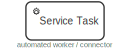
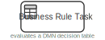
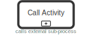
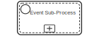
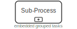
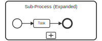
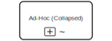
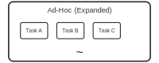
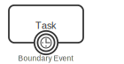
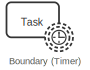

# BPMN 2.0 Complete Element Reference

This reference covers all major BPMN 2.0 elements used in Camunda 8 process models, with visual symbols, descriptions, XML examples, and key behavioural notes.

---

## 1. Gateways

### 1.1 Exclusive Gateway (XOR)


> **Symbol:** Diamond shape with an **X** inside. Routes flow down exactly one outgoing path based on evaluated conditions.

**Purpose:** Splits the process flow into one of several alternative paths, or merges multiple incoming flows into one. Only one path is taken per token.

**Example Scenario:** After a credit check, route the process to "Approve Loan" if the score is above 700, otherwise to "Reject Application."

**XML:**
```xml
<exclusiveGateway id="Gateway_CreditCheck" name="Score OK?" />
<sequenceFlow sourceRef="Gateway_CreditCheck" targetRef="Task_Approve">
  <conditionExpression>= creditScore >= 700</conditionExpression>
</sequenceFlow>
<sequenceFlow sourceRef="Gateway_CreditCheck" targetRef="Task_Reject"
  zeebe:defaultFlow="true"/>
```

**Key Notes:**
- Only **one** outgoing path fires per execution — the first condition that evaluates to `true`.
- Always set a **default flow** to handle cases where no condition matches.
- When used as a **merge**, it passes through whichever branch arrives first (no synchronization).

---

### 1.2 Parallel Gateway (AND)


> **Symbol:** Diamond shape with a **+** (plus) inside. Splits or joins all paths simultaneously.

**Purpose:** Splits the process into multiple parallel branches that all execute concurrently (fork), or waits for all incoming branches to complete before continuing (join).

**Example Scenario:** After order placement, simultaneously trigger "Reserve Stock," "Send Confirmation Email," and "Notify Warehouse" in parallel.

**XML:**
```xml
<parallelGateway id="Gateway_Fork" name="Fork"/>
<parallelGateway id="Gateway_Join" name="Join"/>
<sequenceFlow sourceRef="Gateway_Fork" targetRef="Task_ReserveStock"/>
<sequenceFlow sourceRef="Gateway_Fork" targetRef="Task_SendEmail"/>
<sequenceFlow sourceRef="Gateway_Fork" targetRef="Task_NotifyWarehouse"/>
<sequenceFlow sourceRef="Task_ReserveStock" targetRef="Gateway_Join"/>
<sequenceFlow sourceRef="Task_SendEmail" targetRef="Gateway_Join"/>
<sequenceFlow sourceRef="Task_NotifyWarehouse" targetRef="Gateway_Join"/>
```

**Key Notes:**
- All outgoing paths fire unconditionally — no conditions are evaluated.
- A parallel join **waits** for every incoming branch to arrive before proceeding.
- Mismatched forks and joins cause deadlocks; always pair them symmetrically.

---

### 1.3 Event-Based Gateway


> **Symbol:** Diamond with a double inner circle and a pentagon (or circle with lines), indicating event-driven routing.

**Purpose:** Routes the process based on which event occurs first. The process waits at this gateway until one of the connected intermediate catch events fires.

**Example Scenario:** After sending a payment request, wait for either a "Payment Received" message or a 24-hour timeout — whichever happens first determines the next step.

**XML:**
```xml
<eventBasedGateway id="Gateway_Wait" name="Wait for Response"/>
<intermediateCatchEvent id="Event_Paid" name="Payment Received">
  <messageEventDefinition messageRef="Msg_Payment"/>
</intermediateCatchEvent>
<intermediateCatchEvent id="Event_Timeout" name="24h Elapsed">
  <timerEventDefinition>
    <timeDuration>PT24H</timeDuration>
  </timerEventDefinition>
</intermediateCatchEvent>
<sequenceFlow sourceRef="Gateway_Wait" targetRef="Event_Paid"/>
<sequenceFlow sourceRef="Gateway_Wait" targetRef="Event_Timeout"/>
```

**Key Notes:**
- Only **catch events** (message, timer, signal, conditional) can follow an event-based gateway.
- When one event fires, all other branches are cancelled.
- No conditions are used — routing is purely event-driven.

---

## 2. Tasks

### 2.1 Task


> **Symbol:** Rounded rectangle with no icon in the top-left corner. Plain white background with a label.

**Purpose:** Represents a generic unit of work in a process. Used when the task type is unspecified or when the specific type is not important for the model's purpose.

**Example Scenario:** A "Review Application" step in an HR process where the type of worker (human or system) has not yet been decided.

**XML:**
```xml
<task id="Task_Review" name="Review Application"/>
```

**Key Notes:**
- A plain task has no specific execution semantics in Camunda — use typed tasks (User, Service, etc.) for actual deployment.
- Useful for high-level process modelling before implementation details are known.
- Can be annotated with documentation and data associations.

---

### 2.2 User Task


> **Symbol:** Rounded rectangle with a **person/silhouette icon** in the top-left corner.

**Purpose:** Represents work performed by a human via a task list or form. The process waits until a person completes and submits the task.

**Example Scenario:** A loan officer reviews and approves or rejects a loan application submitted by a customer.

**XML:**
```xml
<userTask id="Task_ApproveLoan" name="Approve Loan Application">
  <extensionElements>
    <zeebe:assignmentDefinition assignee="= loanOfficerId"
      candidateGroups="loan-officers"/>
    <zeebe:formDefinition formKey="approve-loan-form"/>
  </extensionElements>
</userTask>
```

**Key Notes:**
- In Camunda 8, user tasks are managed via **Tasklist** and can be assigned to users or groups.
- Supports form definitions (Camunda Forms, Embedded, or External) for data entry.
- Variables submitted on task completion are propagated into the process scope.

---

### 2.3 Service Task



> **Symbol:** Rounded rectangle with a **gear/cog icon** in the top-left corner.

**Purpose:** Invokes an automated service or system integration. In Camunda 8, this is handled by a **Job Worker** that subscribes to a job type.

**Example Scenario:** Calling a payment gateway API to charge a customer's credit card during checkout.

**XML:**
```xml
<serviceTask id="Task_ChargeCard" name="Charge Credit Card">
  <extensionElements>
    <zeebe:taskDefinition type="charge-credit-card" retries="3"/>
    <zeebe:taskHeaders>
      <zeebe:header key="endpoint" value="https://payments.example.com/charge"/>
    </zeebe:taskHeaders>
  </extensionElements>
</serviceTask>
```

**Key Notes:**
- Requires a **Job Worker** to be deployed and listening for the specified `type`.
- The process waits (suspends the job) until the worker completes and returns variables.
- Supports retry configuration and custom timeout settings.

---

### 2.4 Business Rule Task



> **Symbol:** Rounded rectangle with a **table/grid icon** in the top-left corner.

**Purpose:** Evaluates a business rule, typically a DMN decision table. Returns a decision result as process variables.

**Example Scenario:** Determining the applicable discount percentage for an order based on customer tier and order size using a DMN decision table.

**XML:**
```xml
<businessRuleTask id="Task_CalcDiscount" name="Calculate Discount">
  <extensionElements>
    <zeebe:calledDecision decisionId="discount-rules"
      resultVariable="discountResult"/>
  </extensionElements>
</businessRuleTask>
```

**Key Notes:**
- In Camunda 8, linked directly to a **DMN decision** deployed in the same cluster.
- The `resultVariable` receives the evaluated decision output as a process variable.
- Can also be implemented as a Job Worker if using an external rules engine.

---

### 2.5 Script Task


> **Symbol:** Rounded rectangle with a **scroll/script icon** in the top-left corner.

**Purpose:** Executes a script (e.g., FEEL expression, JavaScript) inline within the process engine without needing an external worker.

**Example Scenario:** Transforming and combining order line items into a formatted summary string before sending a notification.

**XML:**
```xml
<scriptTask id="Task_FormatSummary" name="Format Order Summary">
  <extensionElements>
    <zeebe:script expression='= "Order #" + orderId + " | Total: " + string(total)'
      resultVariable="orderSummary"/>
  </extensionElements>
</scriptTask>
```

**Key Notes:**
- In Camunda 8, script tasks use **FEEL expressions** executed by the engine itself (no worker needed).
- The result of the expression is stored in `resultVariable`.
- Ideal for lightweight data transformations within the process.

---

## 3. Sub-Processes

### 3.1 Call Activity



> **Symbol:** Rounded rectangle with a **thick/bold border** and a small [+] marker at the bottom center, indicating it calls an external process.

**Purpose:** Invokes a separate, reusable process (called element) as a child instance. The parent process waits until the called process completes.

**Example Scenario:** A main order fulfillment process calls a standalone "KYC Verification" sub-process that is shared across multiple parent processes.

**XML:**
```xml
<callActivity id="Call_KYC" name="Verify Identity">
  <extensionElements>
    <zeebe:calledElement processId="kyc-verification-process"
      propagateAllChildVariables="false"/>
    <zeebe:input source="= customerId" target="customerId"/>
    <zeebe:output source="= kycStatus" target="kycStatus"/>
  </extensionElements>
</callActivity>
```

**Key Notes:**
- The called process runs as an **independent process instance** with its own context.
- Variable mapping (input/output) controls data exchange between parent and child.
- Unlike sub-processes, the called process is defined and versioned separately.

---

### 3.2 Transaction


> **Symbol:** Rounded rectangle with a **double border** (two concentric rectangles) and a [+] marker at the bottom, indicating a transactional scope.

**Purpose:** Groups activities into an atomic transactional unit. If the transaction fails or is cancelled, compensation handlers can be triggered to undo completed work.

**Example Scenario:** A payment flow that must either fully complete (reserve funds, charge card, issue receipt) or fully roll back via compensation if any step fails.

**XML:**
```xml
<transaction id="SubProcess_Payment" name="Payment Transaction">
  <startEvent id="Start_T"/>
  <serviceTask id="Task_Reserve" name="Reserve Funds"
    zeebe:type="reserve-funds"/>
  <serviceTask id="Task_Charge" name="Charge Card"
    zeebe:type="charge-card">
    <extensionElements>
      <zeebe:taskDefinition type="charge-card"/>
    </extensionElements>
  </serviceTask>
  <endEvent id="End_T"/>
</transaction>
```

**Key Notes:**
- Supports **compensation** — each task inside can have a compensation handler that is triggered on rollback.
- A **Cancel End Event** inside the transaction triggers cancellation and compensation.
- A **Cancel Boundary Event** on the transaction catches the cancellation from outside.

---

### 3.3 Event Sub-Process



> **Symbol:** Rounded rectangle with a **dashed border** and a small start event circle visible in the top-left corner, with a [+] marker at the bottom.

**Purpose:** An embedded sub-process that is triggered by an event (e.g., error, signal, message) rather than by sequence flow. Used for cross-cutting concerns like error handling or escalation.

**Example Scenario:** An error-handling event sub-process that fires whenever a database error occurs anywhere in the parent process, notifying operations and logging the failure.

**XML:**
```xml
<subProcess id="SubProcess_ErrorHandler" name="Error Handler"
  triggeredByEvent="true">
  <startEvent id="Start_ErrHandler" name="DB Error Caught" isInterrupting="true">
    <errorEventDefinition errorRef="Error_DatabaseFailure"/>
  </startEvent>
  <serviceTask id="Task_Notify" name="Notify Ops Team">
    <extensionElements>
      <zeebe:taskDefinition type="notify-ops"/>
    </extensionElements>
  </serviceTask>
  <endEvent id="End_Handled" name="Error Handled"/>
</subProcess>
```

**Key Notes:**
- The start event type determines the trigger — can be error, message, signal, timer, escalation, or compensation.
- **Interrupting** event sub-processes cancel the parent scope when triggered; **non-interrupting** run in parallel.
- Defined inside the parent process scope but triggered independently of sequence flow.

---

### 3.4 Sub-Process (Collapsed)



> **Symbol:** Rounded rectangle with a thin single border and a [+] marker at the bottom center, hiding the internal flow.

**Purpose:** An embedded sub-process whose internal flow is hidden (collapsed view). Contains its own start and end events and sequence flows, sharing the parent process's scope.

**Example Scenario:** A "Document Processing" sub-process containing several internal steps (scan, validate, file) shown collapsed in a high-level process view.

**XML:**
```xml
<subProcess id="SubProcess_DocProcessing" name="Process Documents">
  <startEvent id="Start_Docs"/>
  <userTask id="Task_Scan" name="Scan Documents"/>
  <serviceTask id="Task_Validate" name="Validate Documents">
    <extensionElements>
      <zeebe:taskDefinition type="validate-docs"/>
    </extensionElements>
  </serviceTask>
  <endEvent id="End_Docs"/>
</subProcess>
```

**Key Notes:**
- Shares variables with the parent scope — no explicit variable mapping needed.
- Boundary events can be attached to the sub-process rectangle to catch errors or timeouts.
- Click the [+] marker in Camunda Modeler to expand and view/edit internal flow.

---

### 3.5 Sub-Process (Expanded)



> **Symbol:** A larger rounded rectangle showing internal process elements (start event, tasks, end event) visibly laid out inside.

**Purpose:** Same as the collapsed sub-process but displayed in expanded form, showing the internal flow inline within the parent diagram.

**Example Scenario:** A "Fulfilment" sub-process shown expanded within a larger order management diagram to give visibility into the pick-pack-ship flow.

**XML:**
```xml
<subProcess id="SubProcess_Fulfilment" name="Fulfilment">
  <startEvent id="Start_Ful"/>
  <serviceTask id="Task_Pick" name="Pick Items">
    <extensionElements>
      <zeebe:taskDefinition type="pick-items"/>
    </extensionElements>
  </serviceTask>
  <serviceTask id="Task_Pack" name="Pack Order">
    <extensionElements>
      <zeebe:taskDefinition type="pack-order"/>
    </extensionElements>
  </serviceTask>
  <serviceTask id="Task_Ship" name="Ship Order">
    <extensionElements>
      <zeebe:taskDefinition type="ship-order"/>
    </extensionElements>
  </serviceTask>
  <endEvent id="End_Ful"/>
</subProcess>
```

**Key Notes:**
- Functionally identical to a collapsed sub-process — the expansion is a display choice only.
- All internal activities share the parent process's variable scope.
- Internal boundary events on child tasks handle exceptions locally before they propagate.

---

### 3.6 Ad-Hoc Sub-Process (Collapsed)



> **Symbol:** Rounded rectangle with a [+] marker and a **tilde (~)** symbol at the bottom, collapsed view.

**Purpose:** An unstructured sub-process where activities inside may be performed in any order, multiple times, or skipped entirely. Useful for flexible, human-driven work.

**Example Scenario:** A due diligence phase in an M&A process where analysts can run background checks, financial reviews, and legal audits in any order they choose.

**XML:**
```xml
<adHocSubProcess id="AdHoc_DueDiligence" name="Due Diligence"
  ordering="Parallel" completionCondition="= allChecksComplete">
  <serviceTask id="Task_BackgroundCheck" name="Background Check">
    <extensionElements>
      <zeebe:taskDefinition type="background-check"/>
    </extensionElements>
  </serviceTask>
  <userTask id="Task_FinancialReview" name="Financial Review"/>
  <userTask id="Task_LegalAudit" name="Legal Audit"/>
</adHocSubProcess>
```

**Key Notes:**
- Activities inside are **not connected by sequence flows** — they are available for execution in any order.
- The `completionCondition` expression defines when the ad-hoc sub-process completes.
- `ordering` can be `Sequential` or `Parallel` to control whether activities run one-at-a-time or concurrently.

---

### 3.7 Ad-Hoc Sub-Process (Expanded)



> **Symbol:** Large rounded rectangle showing multiple task boxes inside without connecting arrows, with a **tilde (~)** at the bottom.

**Purpose:** Same as collapsed ad-hoc, shown in expanded form revealing the available activities inside the flexible work container.

**Example Scenario:** An insurance claim investigation showing the expanded view of all available investigation tasks (interview claimant, inspect damage, review policy) that adjusters can perform in any sequence.

**XML:**
```xml
<adHocSubProcess id="AdHoc_ClaimInvestigation" name="Claim Investigation"
  ordering="Parallel">
  <userTask id="Task_Interview" name="Interview Claimant"/>
  <serviceTask id="Task_Inspect" name="Inspect Damage">
    <extensionElements>
      <zeebe:taskDefinition type="schedule-inspection"/>
    </extensionElements>
  </serviceTask>
  <userTask id="Task_ReviewPolicy" name="Review Policy"/>
</adHocSubProcess>
```

**Key Notes:**
- The tilde (~) symbol distinguishes ad-hoc from standard sub-processes regardless of collapsed or expanded state.
- No sequence flows connect the internal activities — the order is determined at runtime.
- A completion condition or explicit completion trigger signals when the group is done.

---

## 4. Events

### 4.1 Start Event (None)


> **Symbol:** Thin single-border circle with no icon inside. The thinnest border of all event types.

**Purpose:** Marks the beginning of a process instance with no specific trigger. The process is started explicitly by an API call, message, or the Camunda engine.

**Example Scenario:** A process started manually by clicking "Submit" on an application form in a web portal.

**XML:**
```xml
<startEvent id="Start_Process" name="Process Started"/>
```

**Key Notes:**
- Has no event definition — the process is instantiated programmatically or via REST API.
- Every process must have at least one start event.
- A process can have multiple start events of different types (e.g., none + message) for different initiation paths.

---

### 4.2 Intermediate Throw Event (None)


> **Symbol:** Double-border circle with no icon inside. The double ring distinguishes intermediate events from start/end events.

**Purpose:** A pass-through waypoint in the sequence flow with no associated event action. Used for labelling flow transitions or organizing diagram readability.

**Example Scenario:** Marking a conceptual milestone like "Order Confirmed" mid-process without any system action.

**XML:**
```xml
<intermediateThrowEvent id="Event_Milestone" name="Order Confirmed"/>
```

**Key Notes:**
- Has no trigger and no waiting behaviour — execution passes through immediately.
- Primarily used for documentation and diagram organization.
- For events that wait for something to happen, use a **Catch Event** (e.g., message, timer) instead.

---

### 4.3 Boundary Event (Concept)



> **Symbol:** A double-circle event attached to the **border** of a task or sub-process rectangle. The circle sits on the edge of the task shape.

**Purpose:** Catches an event while an activity is executing. If triggered, it either interrupts the activity (solid border) or fires in parallel without interrupting it (dashed border).

**Example Scenario:** A timer boundary event fires after 4 hours on a "Manager Approval" task, sending a reminder email without cancelling the approval task itself (non-interrupting).

**XML:**
```xml
<!-- Interrupting: cancels the task -->
<boundaryEvent id="Boundary_Error" attachedToRef="Task_Process"
  cancelActivity="true">
  <errorEventDefinition errorRef="Error_SystemFailure"/>
</boundaryEvent>

<!-- Non-interrupting: runs in parallel -->
<boundaryEvent id="Boundary_Remind" attachedToRef="Task_Approve"
  cancelActivity="false">
  <timerEventDefinition>
    <timeDuration>PT4H</timeDuration>
  </timerEventDefinition>
</boundaryEvent>
```

**Key Notes:**
- **Interrupting** (solid double border): the attached activity is cancelled and the token moves along the boundary event's outgoing flow.
- **Non-interrupting** (dashed double border): a new token is created on the outgoing flow while the original activity continues.
- `cancelActivity="true"` = interrupting; `cancelActivity="false"` = non-interrupting.

---

### 4.4 End Event (None)


> **Symbol:** Thick single-border circle with no icon. The thickest border of all event types signals the end of a path.

**Purpose:** Marks the end of a process path. When all active tokens reach end events, the process instance completes.

**Example Scenario:** The final step when all process activities have been completed and the process closes normally.

**XML:**
```xml
<endEvent id="End_Process" name="Process Complete"/>
```

**Key Notes:**
- Multiple end events can exist in a process — the process completes when all active tokens have reached an end event.
- A none end event simply terminates the current path (token) without any side effects.
- For actions on completion (send message, signal, terminate all tokens), use typed end events.

---

### 4.5 Start Event (Message)


> **Symbol:** Thin single-border circle with an **envelope/message icon** (outlined rectangle with V-fold) inside.

**Purpose:** Starts a process when a specific message is received. The process instance is created by an incoming message correlated to this start event.

**Example Scenario:** A customer order process triggered when an "Order Placed" message arrives from the e-commerce storefront.

**XML:**
```xml
<message id="Msg_OrderPlaced" name="order-placed"/>
<startEvent id="Start_Order" name="Order Received">
  <messageEventDefinition messageRef="Msg_OrderPlaced"/>
</startEvent>
```

**Key Notes:**
- The `name` attribute of the message must match the message name used when publishing to Camunda.
- Multiple process instances can be created if multiple messages arrive.
- Correlation variables can be set on the message event for instance matching.

---

### 4.6 Start Event (Timer)


> **Symbol:** Thin single-border circle with a **clock icon** (circle with tick marks and hands) inside.

**Purpose:** Starts a process at a specific time, after a delay, or on a recurring schedule.

**Example Scenario:** A monthly report generation process that starts automatically on the 1st of every month at 6:00 AM.

**XML:**
```xml
<startEvent id="Start_Monthly" name="Monthly Report Due">
  <timerEventDefinition>
    <timeCycle>R/P1M</timeCycle>
  </timerEventDefinition>
</startEvent>
```

**Key Notes:**
- Supports `timeCycle` (repeating, ISO 8601 interval), `timeDate` (specific datetime), and `timeDuration` (delay after deployment).
- A timer start event creates **new process instances** on each firing when using a cycle.
- The timer is managed by the Camunda job scheduler — no external trigger is needed.

---

### 4.7 Start Event (Conditional)


> **Symbol:** Thin single-border circle with a **document/list icon** (rectangle with horizontal lines) inside.

**Purpose:** Starts a process when a specified condition on process data becomes true. Used to react to changing data states.

**Example Scenario:** A re-order process that triggers automatically when inventory stock for a product drops below the minimum threshold.

**XML:**
```xml
<startEvent id="Start_LowStock" name="Low Stock Detected">
  <conditionalEventDefinition>
    <condition>= stockLevel &lt; minimumStock</condition>
  </conditionalEventDefinition>
</startEvent>
```

**Key Notes:**
- The condition is re-evaluated when relevant process variables change.
- Useful for data-driven process initiation without polling.
- In Camunda 8, conditional events are evaluated by the engine when variable data is updated.

---

### 4.8 Start Event (Signal)


> **Symbol:** Thin single-border circle with a **triangle/signal icon** (outlined triangle) inside.

**Purpose:** Starts a process when a broadcast signal is received. Unlike messages, signals are broadcast to all processes listening for that signal name.

**Example Scenario:** All regional approval processes start simultaneously when a "System Maintenance Window" signal is broadcast.

**XML:**
```xml
<signal id="Sig_Maintenance" name="system-maintenance"/>
<startEvent id="Start_Maintenance" name="Maintenance Signal Received">
  <signalEventDefinition signalRef="Sig_Maintenance"/>
</signalEventDefinition>
</startEvent>
```

**Key Notes:**
- Signals are **broadcast** — every process with a matching start event receives and starts a new instance.
- Unlike messages, signals cannot be correlated to specific process instances.
- Signal names must match exactly between throw and catch definitions.

---

### 4.9 Intermediate Catch Event (Message)


> **Symbol:** Double-border circle with an **outlined envelope icon** inside (white fill = catching).

**Purpose:** Pauses the process flow and waits for a specific message to arrive before continuing.

**Example Scenario:** After sending a payment request, the process waits at this event until a "Payment Confirmed" message is received from the payment service.

**XML:**
```xml
<message id="Msg_PaymentConfirmed" name="payment-confirmed"/>
<intermediateCatchEvent id="Event_WaitPayment" name="Payment Confirmed">
  <messageEventDefinition messageRef="Msg_PaymentConfirmed"/>
</intermediateCatchEvent>
```

**Key Notes:**
- The process instance is suspended at this event until the specified message arrives.
- Messages are correlated by message name and optional correlation keys (variables).
- Only one process instance receives a given message (unicast, unlike signals).

---

### 4.10 Intermediate Throw Event (Message)


> **Symbol:** Double-border circle with a **filled (dark) envelope icon** inside (filled = throwing/sending).

**Purpose:** Sends a message to an external participant or another process as the execution passes through this event.

**Example Scenario:** Sending a "Shipment Dispatched" message to the customer notification service as the order fulfilment process progresses.

**XML:**
```xml
<intermediateThrowEvent id="Event_SendShipped" name="Notify Shipped">
  <messageEventDefinition messageRef="Msg_Shipped">
    <extensionElements>
      <zeebe:subscription correlationKey="= orderId"/>
    </extensionElements>
  </messageEventDefinition>
</intermediateThrowEvent>
```

**Key Notes:**
- Execution continues immediately after sending — there is no waiting.
- In Camunda 8, message throw events are handled by job workers subscribed to the message type.
- Requires a correlation key if the message is directed at a specific process instance.

---

### 4.11 Intermediate Catch Event (Timer)


> **Symbol:** Double-border circle with a **clock icon** inside.

**Purpose:** Pauses the process for a specified duration or until a specific date/time before continuing.

**Example Scenario:** After sending a quote to a customer, the process waits 7 days before following up if no response has been received.

**XML:**
```xml
<intermediateCatchEvent id="Event_Wait7Days" name="7-Day Follow-up Wait">
  <timerEventDefinition>
    <timeDuration>P7D</timeDuration>
  </timerEventDefinition>
</intermediateCatchEvent>
```

**Key Notes:**
- Supports `timeDuration` (wait for a period), `timeDate` (wait until a specific date), and `timeCycle` (recurring — though cycles are more common on boundary events).
- The timer is managed by Camunda's job scheduler; no external trigger is needed.
- FEEL expressions can be used for dynamic durations, e.g., `= duration("P" + waitDays + "D")`.

---

### 4.12 Intermediate Throw Event (Escalation)


> **Symbol:** Double-border circle with a **filled escalation arrow** (upward-pointing chevron/kite shape, filled dark) inside.

**Purpose:** Throws an escalation signal upward to a parent process or an escalation boundary event. Used for SLA breaches or approval escalations.

**Example Scenario:** If a task has been waiting more than 2 hours for a manager response, throw an escalation to notify the department head.

**XML:**
```xml
<escalation id="Esc_SLABreach" name="SLA-Breach"
  escalationCode="SLA_BREACH"/>
<intermediateThrowEvent id="Event_Escalate" name="Escalate SLA Breach">
  <escalationEventDefinition escalationRef="Esc_SLABreach"/>
</intermediateThrowEvent>
```

**Key Notes:**
- Escalations bubble **upward** through sub-process boundaries to parent scopes.
- Unlike errors, escalation throw events do **not** terminate the current flow — execution continues after the throw.
- Can be caught by an escalation boundary event on an enclosing sub-process.

---

### 4.13 Intermediate Catch Event (Conditional)


> **Symbol:** Double-border circle with a **document/list icon** inside.

**Purpose:** Pauses the process and waits until a specified data condition becomes true before continuing.

**Example Scenario:** A process waiting in an approval stage resumes only when the `approvalStatus` variable is set to `"APPROVED"`.

**XML:**
```xml
<intermediateCatchEvent id="Event_WaitApproval" name="Wait for Approval">
  <conditionalEventDefinition>
    <condition>= approvalStatus = "APPROVED"</condition>
  </conditionalEventDefinition>
</intermediateCatchEvent>
```

**Key Notes:**
- The condition is re-evaluated each time variables in scope change.
- Execution resumes as soon as the condition evaluates to `true`.
- Useful for data-driven synchronization without explicit message passing.

---

### 4.14 Intermediate Catch Event (Link)


> **Symbol:** Double-border circle with an **outlined right-pointing arrow** inside (the "incoming" side of a page connector).

**Purpose:** Acts as the "entry point" of a link connector — receives a link from a corresponding Link Throw Event. Used to connect distant parts of a diagram without crossing lines.

**Example Scenario:** The end of a complex error handling flow jumps back to the main process flow using a link pair (Throw → Catch) to avoid cluttered sequence flow lines.

**XML:**
```xml
<intermediateCatchEvent id="Link_MainFlow_In" name="Return to Main Flow">
  <linkEventDefinition name="MainFlowLink"/>
</intermediateCatchEvent>
```

**Key Notes:**
- Links are **within the same process** — they are not inter-process communication.
- A link catch event must have exactly one corresponding throw event with the same link name.
- Execution is continuous: link events are just a visual routing aid, not a real wait.

---

### 4.15 Intermediate Throw Event (Link)


> **Symbol:** Double-border circle with a **filled right-pointing arrow** inside (the "outgoing" side of a page connector).

**Purpose:** Acts as the "exit point" of a link connector — sends execution to a corresponding Link Catch Event in the same process. Used to simplify complex diagrams.

**Example Scenario:** At the end of a long exception path, a link throw event jumps execution back to a specific point in the main flow without drawing a long return sequence flow.

**XML:**
```xml
<intermediateThrowEvent id="Link_MainFlow_Out" name="Go to Main Flow">
  <linkEventDefinition name="MainFlowLink"/>
</intermediateThrowEvent>
```

**Key Notes:**
- There is no waiting — execution transfers immediately to the paired catch event.
- The link name must **exactly match** the corresponding catch event's link name.
- Multiple throw events can point to the same catch event (many-to-one linking).

---

### 4.16 Intermediate Throw Event (Compensation)


> **Symbol:** Double-border circle with two **filled left-pointing triangles** (rewind arrows) inside.

**Purpose:** Triggers compensation for a previously completed activity. Compensation handlers (tasks linked with compensation associations) are invoked to undo completed work.

**Example Scenario:** After a payment reservation step fails downstream, trigger compensation to release the reserved funds via the "Release Reservation" compensation handler.

**XML:**
```xml
<intermediateThrowEvent id="Event_Compensate" name="Compensate Reservation">
  <compensateEventDefinition activityRef="Task_ReserveFunds"/>
</intermediateThrowEvent>
```

**Key Notes:**
- The `activityRef` specifies which completed task to compensate — its linked compensation handler task will be executed.
- Compensation tasks are connected to their target via a **compensation association** (dashed arrow with open triangle).
- Compensation flows backwards through completed activities — it is not a normal sequence flow.

---

### 4.17 Intermediate Catch Event (Signal)


> **Symbol:** Double-border circle with an **outlined triangle** (signal) inside.

**Purpose:** Pauses the process and waits for a broadcast signal with a matching name to be received before continuing.

**Example Scenario:** Multiple regional processes pause and wait for the "Campaign Launch" signal before proceeding with their regional activation steps.

**XML:**
```xml
<signal id="Sig_CampaignLaunch" name="campaign-launch"/>
<intermediateCatchEvent id="Event_WaitLaunch" name="Campaign Launch Signal">
  <signalEventDefinition signalRef="Sig_CampaignLaunch"/>
</intermediateCatchEvent>
```

**Key Notes:**
- Signals are broadcast — all instances waiting for the named signal will receive it simultaneously.
- No correlation key is used; all matching listeners receive the signal.
- Can coordinate multiple independent process instances in parallel.

---

### 4.18 Intermediate Throw Event (Signal)


> **Symbol:** Double-border circle with a **filled (dark) triangle** inside.

**Purpose:** Broadcasts a signal to all processes and sub-processes that are listening for the named signal.

**Example Scenario:** A master campaign process broadcasts the "Go-Live" signal to simultaneously trigger all waiting regional sub-processes.

**XML:**
```xml
<intermediateThrowEvent id="Event_BroadcastGoLive" name="Broadcast Go-Live">
  <signalEventDefinition signalRef="Sig_GoLive"/>
</intermediateThrowEvent>
```

**Key Notes:**
- The signal is broadcast to **all** waiting listeners — there is no targeted delivery.
- Execution continues immediately after the signal is thrown (no waiting for receivers).
- Useful for coordinating fan-out triggers across multiple independent processes.

---

### 4.19 End Event (Message)


> **Symbol:** Thick-border circle with a **filled (dark) envelope icon** inside.

**Purpose:** Sends a message to an external participant or system when the process path ends. The process path concludes after sending.

**Example Scenario:** At the end of an order process, send an "Order Completed" message to the shipping partner's message queue.

**XML:**
```xml
<endEvent id="End_NotifyPartner" name="Notify Shipping Partner">
  <messageEventDefinition messageRef="Msg_OrderComplete"/>
</endEvent>
```

**Key Notes:**
- The message is sent and the process path terminates — there is no waiting for a response.
- In Camunda 8, this is implemented via a Job Worker that handles the message sending.
- Ensure the message definition and its target (e.g., queue, topic) are correctly configured.

---

### 4.20 End Event (Escalation)


> **Symbol:** Thick-border circle with a **filled escalation arrow** (upward kite shape, dark filled) inside.

**Purpose:** Throws an escalation when the process path ends, typically within a sub-process. The escalation propagates to the parent scope to be caught by an escalation boundary or event sub-process.

**Example Scenario:** A sub-process for order approval ends with an escalation when the order value exceeds the approver's authority limit, escalating to a senior approver in the parent process.

**XML:**
```xml
<escalation id="Esc_AuthLimit" name="Authority-Limit-Exceeded"
  escalationCode="AUTH_LIMIT"/>
<endEvent id="End_Escalate" name="Escalate for Senior Approval">
  <escalationEventDefinition escalationRef="Esc_AuthLimit"/>
</endEvent>
```

**Key Notes:**
- This is an **end event** — it terminates the current sub-process scope and throws the escalation.
- The parent process must have a matching escalation boundary event or event sub-process to catch it.
- Unlike error end events, escalation end events allow the parent process to continue gracefully.

---

### 4.21 End Event (Error)


> **Symbol:** Thick-border circle with a **filled lightning bolt icon** inside.

**Purpose:** Throws a BPMN error when the process path ends. Terminates the current sub-process scope and propagates the error to an error boundary event or error event sub-process in the parent.

**Example Scenario:** A payment sub-process ends with an error when the card is declined, causing the parent process to route to the "Handle Payment Failure" path.

**XML:**
```xml
<error id="Error_CardDeclined" name="Card Declined" errorCode="CARD_DECLINED"/>
<endEvent id="End_CardError" name="Card Declined">
  <errorEventDefinition errorRef="Error_CardDeclined"/>
</endEvent>
```

**Key Notes:**
- BPMN errors are **business errors** (e.g., insufficient funds, validation failure) — not technical exceptions.
- The error propagates up through sub-process boundaries until caught or the process terminates.
- Must be caught by an error boundary event (`cancelActivity="true"`) or error event sub-process.

---

### 4.22 End Event (Cancel)


> **Symbol:** Thick-border circle with an **X (cross)** icon inside.

**Purpose:** Cancels a **transaction sub-process**. Used exclusively inside transaction sub-processes to trigger cancellation and invoke compensation handlers.

**Example Scenario:** A payment transaction is cancelled mid-execution when a fraud check fails, triggering compensation to reverse all partial charges already made.

**XML:**
```xml
<endEvent id="End_CancelTransaction" name="Cancel Payment">
  <cancelEventDefinition/>
</endEvent>
```

**Key Notes:**
- **Only valid inside a Transaction sub-process** — has no meaning outside of transactions.
- Triggers the **Cancel Boundary Event** on the enclosing transaction, which then runs compensation.
- All completed activities within the transaction may have their compensation handlers invoked.

---

### 4.23 End Event (Compensation)


> **Symbol:** Thick-border circle with two **filled left-pointing triangles** (rewind symbols) inside.

**Purpose:** Triggers compensation for all completed activities in the current scope when this end event is reached, then terminates the path.

**Example Scenario:** A booking process reaches a dead end due to unavailable inventory, and the compensation end event triggers reversal of all previously confirmed reservations.

**XML:**
```xml
<endEvent id="End_Compensate" name="Reverse All Bookings">
  <compensateEventDefinition/>
</endEvent>
```

**Key Notes:**
- Invokes all compensation handlers for activities completed in the current scope.
- Unlike the intermediate compensation throw, no specific `activityRef` is required — all completed activities in scope are compensated.
- Typically used in transaction scopes alongside cancel/error handling.

---

### 4.24 End Event (Signal)


> **Symbol:** Thick-border circle with a **filled (dark) triangle** inside.

**Purpose:** Broadcasts a signal to all listening processes when this process path ends.

**Example Scenario:** When the master process completes onboarding, it broadcasts a "Onboarding Complete" signal to notify all downstream integration processes simultaneously.

**XML:**
```xml
<signal id="Sig_OnboardingDone" name="onboarding-complete"/>
<endEvent id="End_BroadcastDone" name="Broadcast Onboarding Complete">
  <signalEventDefinition signalRef="Sig_OnboardingDone"/>
</endEvent>
```

**Key Notes:**
- The signal is broadcast to **all** processes listening for the named signal.
- The process path terminates after broadcasting — no waiting for responses.
- Suitable for triggering fan-out notifications to multiple downstream processes simultaneously.

---

### 4.25 End Event (Terminate)


> **Symbol:** Thick-border circle with a **filled solid circle** inside (circle within a circle).

**Purpose:** Immediately terminates the **entire process instance** (all tokens, all parallel branches) when reached. A "hard stop" for the process.

**Example Scenario:** When a fraud alert is confirmed, all parallel processing paths (shipping, notification, billing) must be immediately stopped, so a terminate end event is used.

**XML:**
```xml
<endEvent id="End_Terminate" name="Fraud Confirmed - Terminate">
  <terminateEventDefinition/>
</endEvent>
```

**Key Notes:**
- Unlike a none end event (which ends only the current token), terminate ends **all active tokens** in the process.
- Within a sub-process, terminate only kills tokens within that sub-process scope, not the parent.
- Use with care — it bypasses normal completion logic and cleanup activities.

---

### 4.26 Boundary Event (Message) — Interrupting


> **Symbol:** Double-border circle (solid lines) attached to a task border, with an **outlined envelope icon** inside.

**Purpose:** Catches a message while the attached task is active. When the message arrives, it interrupts (cancels) the task and routes the token along the boundary event's outgoing flow.

**Example Scenario:** While waiting for a user to complete a review task, a "Task Recalled" message from an external system cancels the task immediately and reroutes to a "Handle Recall" path.

**XML:**
```xml
<boundaryEvent id="Boundary_RecallMsg" attachedToRef="Task_Review"
  cancelActivity="true">
  <messageEventDefinition messageRef="Msg_TaskRecalled"/>
</boundaryEvent>
<sequenceFlow sourceRef="Boundary_RecallMsg" targetRef="Task_HandleRecall"/>
```

**Key Notes:**
- **Interrupting** (`cancelActivity="true"`): the task is cancelled when the message arrives.
- The boundary event must have exactly one outgoing sequence flow.
- The message must be correlated to the correct process instance using correlation keys.

---

### 4.27 Boundary Event (Timer) — Interrupting



> **Symbol:** Double-border circle (solid lines) attached to a task border, with a **clock icon** inside.

**Purpose:** Triggers after a duration or at a specific time while the task is active. When fired, it interrupts the task and follows the outgoing flow.

**Example Scenario:** A 2-hour deadline on an approval task — if the manager does not respond within 2 hours, the task is cancelled and escalated automatically.

**XML:**
```xml
<boundaryEvent id="Boundary_Deadline" attachedToRef="Task_Approve"
  cancelActivity="true">
  <timerEventDefinition>
    <timeDuration>PT2H</timeDuration>
  </timerEventDefinition>
</boundaryEvent>
<sequenceFlow sourceRef="Boundary_Deadline" targetRef="Task_AutoEscalate"/>
```

**Key Notes:**
- **Interrupting**: the task is cancelled when the timer fires.
- Duration starts when the attached task becomes active (not when the process starts).
- For reminders without cancellation, use the non-interrupting timer boundary event instead.

---

### 4.28 Boundary Event (Escalation) — Interrupting


> **Symbol:** Double-border circle (solid lines) with an **outlined escalation arrow** (hollow upward kite shape) inside.

**Purpose:** Catches an escalation thrown by activities within the attached sub-process. When caught, interrupts the sub-process and routes to escalation handling.

**Example Scenario:** Catches an escalation thrown inside an "Approval" sub-process when the escalation code indicates authority limits were exceeded, routing to a senior approver task.

**XML:**
```xml
<boundaryEvent id="Boundary_AuthEsc" attachedToRef="SubProcess_Approval"
  cancelActivity="true">
  <escalationEventDefinition escalationRef="Esc_AuthLimit"/>
</boundaryEvent>
<sequenceFlow sourceRef="Boundary_AuthEsc" targetRef="Task_SeniorApprover"/>
```

**Key Notes:**
- **Interrupting**: cancels the sub-process when the escalation is caught.
- Escalations propagate **upward** through sub-process boundaries.
- For non-interrupting escalation handling (let the sub-process continue), use the non-interrupting variant.

---

### 4.29 Boundary Event (Conditional) — Interrupting


> **Symbol:** Double-border circle (solid lines) with a **document/list icon** inside.

**Purpose:** Interrupts the attached task when a condition on process data becomes true during task execution.

**Example Scenario:** A user task for processing an order is cancelled and rerouted when the `stockAvailable` variable changes to `false` during the task's execution period.

**XML:**
```xml
<boundaryEvent id="Boundary_OutOfStock" attachedToRef="Task_ProcessOrder"
  cancelActivity="true">
  <conditionalEventDefinition>
    <condition>= stockAvailable = false</condition>
  </conditionalEventDefinition>
</boundaryEvent>
<sequenceFlow sourceRef="Boundary_OutOfStock" targetRef="Task_HandleOutOfStock"/>
```

**Key Notes:**
- **Interrupting**: cancels the task when the condition becomes true.
- The condition is evaluated when variables in the task's scope are updated.
- Use for reactive, data-driven interruption of in-progress activities.

---

### 4.30 Boundary Event (Error) — Interrupting


> **Symbol:** Double-border circle (solid lines) with an **outlined lightning bolt** inside.

**Purpose:** Catches a BPMN error thrown by the attached task or sub-process. Always interrupting — errors always cancel the activity. Routes to an error handling path.

**Example Scenario:** A service task calling an external API throws an error when the API returns a 500 response, which the error boundary event catches and routes to a retry or fallback path.

**XML:**
```xml
<boundaryEvent id="Boundary_APIError" attachedToRef="Task_CallAPI"
  cancelActivity="true">
  <errorEventDefinition errorRef="Error_APIFailure"/>
</boundaryEvent>
<sequenceFlow sourceRef="Boundary_APIError" targetRef="Task_FallbackHandler"/>
```

**Key Notes:**
- Error boundary events are **always interrupting** — `cancelActivity` is always `true`.
- Can catch a specific error (by `errorRef`) or any error (by omitting `errorRef`).
- In Camunda 8, Job Workers can throw BPMN errors using the `throwBpmnError()` API.

---

### 4.31 Boundary Event (Cancel) — Interrupting


> **Symbol:** Double-border circle (solid lines) with an **X (cross)** icon inside.

**Purpose:** Catches the cancellation of a **Transaction sub-process**. Placed on the boundary of a transaction; triggered when a Cancel End Event fires inside the transaction.

**Example Scenario:** When the payment transaction sub-process is cancelled (e.g., fraud detected), the cancel boundary event routes execution to a "Reverse All Charges" compensation path.

**XML:**
```xml
<boundaryEvent id="Boundary_TxCancel" attachedToRef="SubProcess_PaymentTx"
  cancelActivity="true">
  <cancelEventDefinition/>
</boundaryEvent>
<sequenceFlow sourceRef="Boundary_TxCancel" targetRef="Task_ReverseCharges"/>
```

**Key Notes:**
- **Only valid on Transaction sub-processes** — cannot be attached to regular tasks.
- Always interrupting — `cancelActivity` is always `true` for cancel boundary events.
- After catching the cancellation, the engine invokes compensation handlers before following the outgoing flow.

---

### 4.32 Boundary Event (Signal) — Interrupting


> **Symbol:** Double-border circle (solid lines) with an **outlined triangle** inside.

**Purpose:** Catches a broadcast signal while the attached activity is active. Interrupts the activity and routes execution along the boundary event's outgoing flow.

**Example Scenario:** A "System Shutdown" signal is broadcast while tasks are in progress, causing all attached signal boundary events to fire and route each task to its graceful termination path.

**XML:**
```xml
<boundaryEvent id="Boundary_Shutdown" attachedToRef="Task_Process"
  cancelActivity="true">
  <signalEventDefinition signalRef="Sig_SystemShutdown"/>
</boundaryEvent>
<sequenceFlow sourceRef="Boundary_Shutdown" targetRef="Task_GracefulStop"/>
```

**Key Notes:**
- **Interrupting**: cancels the task when the signal is received.
- Signals are broadcast — ALL instances with matching signal boundary events will react.
- Cannot be used for targeted communication; use message boundary events for instance-specific triggers.

---

### 4.33 Boundary Event (Compensation) — Interrupting


> **Symbol:** Double-border circle (solid lines) with two **outlined left-pointing triangles** inside.

**Purpose:** Defines a compensation handler for the attached task. When compensation is triggered for that task, this boundary event activates the compensation flow.

**Example Scenario:** When an order reservation task is compensated (due to a cancelled transaction), the compensation boundary event activates the "Release Reservation" task to undo the reservation.

**XML:**
```xml
<boundaryEvent id="Boundary_Comp_Reserve" attachedToRef="Task_Reserve"
  cancelActivity="true">
  <compensateEventDefinition/>
</boundaryEvent>
<!-- Compensation association (not a sequence flow) -->
<association sourceRef="Boundary_Comp_Reserve" targetRef="Task_ReleaseReservation"
  associationDirection="One"/>
```

**Key Notes:**
- Compensation boundary events use **associations** (not sequence flows) to link to their compensation task.
- They are **not triggered by normal sequence flow** — only by compensation throw events or compensation end events.
- The compensation task runs in the context of the original completed activity's data.

---

### 4.34 Boundary Event (Message) — Non-Interrupting


> **Symbol:** Double-border circle with **dashed lines** (non-interrupting) and an outlined envelope icon inside.

**Purpose:** Catches a message while the attached task continues running. Creates a new parallel token on the outgoing flow without cancelling the task.

**Example Scenario:** While a document review task is ongoing, a "Priority Update" message triggers a parallel notification flow to the reviewer without stopping the review.

**XML:**
```xml
<boundaryEvent id="Boundary_PriorityMsg" attachedToRef="Task_Review"
  cancelActivity="false">
  <messageEventDefinition messageRef="Msg_PriorityUpdate"/>
</boundaryEvent>
<sequenceFlow sourceRef="Boundary_PriorityMsg" targetRef="Task_NotifyReviewer"/>
```

**Key Notes:**
- **Non-interrupting** (`cancelActivity="false"`): the task continues; a parallel branch is created.
- The dashed double border visually distinguishes non-interrupting from interrupting boundary events.
- Multiple non-interrupting boundary events can fire on the same task simultaneously.

---

### 4.35 Boundary Event (Escalation) — Non-Interrupting


> **Symbol:** Double-border circle with **dashed lines** and an outlined escalation arrow inside.

**Purpose:** Catches an escalation thrown within the attached sub-process while allowing the sub-process to continue. Creates a parallel escalation handling path.

**Example Scenario:** An SLA escalation is caught by a non-interrupting boundary event on an approval sub-process, sending a reminder to the approver while the sub-process continues waiting.

**XML:**
```xml
<boundaryEvent id="Boundary_SLAEsc" attachedToRef="SubProcess_Approval"
  cancelActivity="false">
  <escalationEventDefinition escalationRef="Esc_SLAWarning"/>
</boundaryEvent>
<sequenceFlow sourceRef="Boundary_SLAEsc" targetRef="Task_SendReminder"/>
```

**Key Notes:**
- **Non-interrupting**: the sub-process keeps running after the escalation is caught.
- Ideal for SLA reminders, notifications, and monitoring side-effects.
- Can fire multiple times if the escalation is thrown repeatedly within the sub-process.

---

### 4.36 Boundary Event (Conditional) — Non-Interrupting


> **Symbol:** Double-border circle with **dashed lines** and a document/list icon inside.

**Purpose:** Triggers a parallel action when a condition becomes true during task execution, without cancelling the task.

**Example Scenario:** While a long-running data processing task is active, a non-interrupting conditional boundary event fires when `processingProgress > 50` to show a progress notification in the UI.

**XML:**
```xml
<boundaryEvent id="Boundary_Progress" attachedToRef="Task_ProcessData"
  cancelActivity="false">
  <conditionalEventDefinition>
    <condition>= processingProgress &gt; 50</condition>
  </conditionalEventDefinition>
</boundaryEvent>
<sequenceFlow sourceRef="Boundary_Progress" targetRef="Task_ShowProgress"/>
```

**Key Notes:**
- **Non-interrupting**: the data processing task continues while the side-effect runs.
- The condition is checked whenever relevant variables change.
- Useful for audit logging, progress tracking, or triggering side notifications.

---

### 4.37 Boundary Event (Signal) — Non-Interrupting


> **Symbol:** Double-border circle with **dashed lines** and an outlined triangle inside.

**Purpose:** Catches a broadcast signal while the attached activity continues. Triggers a parallel path without interrupting the main task execution.

**Example Scenario:** A "Market Conditions Changed" signal is broadcast while multiple order processing tasks are running. Each task's non-interrupting signal boundary event fires a parallel risk re-assessment without stopping the order processing.

**XML:**
```xml
<boundaryEvent id="Boundary_MarketSignal" attachedToRef="Task_ProcessOrder"
  cancelActivity="false">
  <signalEventDefinition signalRef="Sig_MarketChange"/>
</boundaryEvent>
<sequenceFlow sourceRef="Boundary_MarketSignal" targetRef="Task_RiskReassess"/>
```

**Key Notes:**
- **Non-interrupting**: the task continues; a parallel branch is created on signal receipt.
- Since signals are broadcast, all instances with this boundary event will react.
- Can fire multiple times if the signal is broadcast repeatedly while the task is active.

---

## Quick Reference Summary

### Event Border Styles

| Style | Meaning |
|-------|---------|
| Thin single border | Start event |
| Double border (solid) | Intermediate event / Interrupting boundary |
| Double border (dashed) | Non-interrupting boundary event |
| Thick single border | End event |

### Event Icon Fill

| Fill | Meaning |
|------|---------|
| Outlined (white fill) | Catching — waiting to receive |
| Filled (dark fill) | Throwing — sending/broadcasting |

### Gateway Decision Types

| Gateway | Icon | Routing |
|---------|------|---------|
| Exclusive (XOR) | X | One path only |
| Parallel (AND) | + | All paths |
| Inclusive (OR) | O | One or more paths |
| Event-Based | Circles/pentagon | First event wins |

### Task Type Icons

| Icon | Task Type | Executor |
|------|-----------|---------|
| None | Generic Task | Unspecified |
| Person | User Task | Human via Tasklist |
| Gear | Service Task | Job Worker |
| Grid/Table | Business Rule Task | DMN Engine |
| Scroll | Script Task | FEEL/Engine |
| Bold border + [+] | Call Activity | Separate process |

---

*Reference based on BPMN 2.0 specification and Camunda 8 implementation. For Camunda-specific extensions, see the [Camunda 8 documentation](https://docs.camunda.io).*
