# Kafka with Spring Boot

## Table of Contents
1. [What is Kafka?](#what-is-kafka)
2. [What is Zookeeper?](#what-is-zookeeper)
3. [Kafka Architecture](#kafka-architecture)
4. [Key Concepts](#key-concepts)
5. [Download and Install Kafka](#download-and-install-kafka)
6. [Starting Kafka on Windows](#starting-kafka-on-windows)
7. [Kafka CLI Commands](#kafka-cli-commands)
8. [Integration with Spring Boot](#integration-with-spring-boot)
9. [Producers](#producers)
10. [KafkaTemplate — All Methods Explained](#kafkatemplate--all-methods-explained)
11. [Consumers](#consumers)
12. [Consumer Groups](#consumer-groups)
13. [Topics and Partitions](#topics-and-partitions)
14. [Message Serialization](#message-serialization)
15. [Message Retry Mechanism and Redelivery Policy](#message-retry-mechanism-and-redelivery-policy)
16. [Dead Letter Topics](#dead-letter-topics)
17. [Kafka Streams (Overview)](#kafka-streams-overview)
18. [Complete Example](#complete-example)
19. [Best Practices](#best-practices)

---

## What is Kafka?

Apache Kafka is a distributed, high-throughput, fault-tolerant **event streaming platform**. It is designed to handle trillions of events per day, functioning as a real-time data pipeline and streaming engine.

Unlike traditional message brokers (like ActiveMQ or RabbitMQ), Kafka **retains messages on disk** for a configurable period regardless of whether they have been consumed — making it suitable for both messaging and event sourcing patterns.

### Key Features

- **High throughput**: Handles millions of messages per second across distributed clusters
- **Fault tolerance**: Data is replicated across multiple brokers
- **Scalability**: Scales horizontally by adding brokers and partitions
- **Durability**: Messages are persisted to disk and retained for a configurable period
- **Ordering guarantees**: Messages within a partition are strictly ordered
- **Replay**: Consumers can re-read messages from any offset
- **Decoupling**: Producers and consumers are fully decoupled
- **Exactly-once semantics**: Supported with Kafka Transactions

### Use Cases

- Real-time event streaming and processing
- Log aggregation across microservices
- Change Data Capture (CDC) for database synchronization
- Activity tracking (page views, clicks, user behavior)
- Financial transaction processing
- Metrics collection and monitoring
- ETL pipelines and data integration
- Event sourcing for CQRS architectures

---

## What is Zookeeper?

Apache ZooKeeper is a distributed coordination service that Kafka historically used to manage cluster metadata, leader election, and configuration. In older Kafka versions (before 2.8), Zookeeper was a mandatory dependency.

### What ZooKeeper Does for Kafka

- **Broker registration**: Tracks which brokers are alive in the cluster
- **Leader election**: Decides which broker replica is the leader for each partition
- **Topic metadata**: Stores topic configurations and partition assignments
- **Controller election**: Elects one broker as the cluster controller
- **Consumer group coordination**: In older Kafka versions, managed consumer group offsets (now stored in Kafka itself)

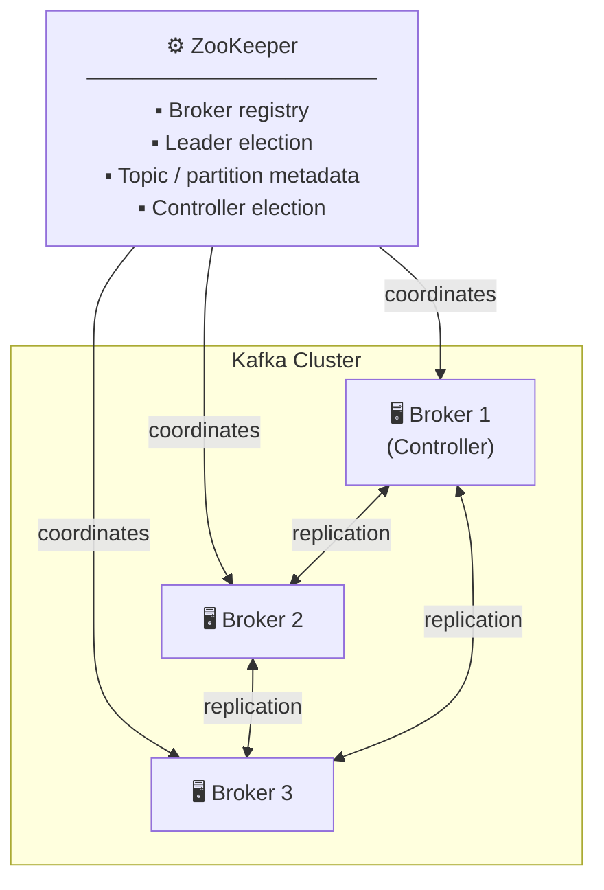
```mermaid
graph TB
    ZK["⚙️ ZooKeeper\n───────────────────\n▪ Broker registry\n▪ Leader election\n▪ Topic / partition metadata\n▪ Controller election"]

    subgraph Cluster["Kafka Cluster"]
        B1["🖥️ Broker 1\n(Controller)"]
        B2["🖥️ Broker 2"]
        B3["🖥️ Broker 3"]
    end

    ZK -->|coordinates| B1
    ZK -->|coordinates| B2
    ZK -->|coordinates| B3
    B1 <-->|replication| B2
    B2 <-->|replication| B3
    B1 <-->|replication| B3
```

### KRaft Mode (ZooKeeper Replacement)

Starting with Kafka 3.3, **KRaft mode** (Kafka Raft Metadata mode) became the recommended approach. KRaft eliminates ZooKeeper entirely — Kafka manages its own metadata using the Raft consensus protocol internally.

| Feature | ZooKeeper Mode | KRaft Mode |
|---------|---------------|------------|
| Separate ZooKeeper process | Required | Not needed |
| Operational complexity | Higher | Lower |
| Stability | Mature | Production-ready since Kafka 3.3 |
| Metadata scalability | Limited (~200k partitions) | Much higher (millions of partitions) |
| Startup time | Slower | Faster |
| Recommended for new clusters | No | Yes |

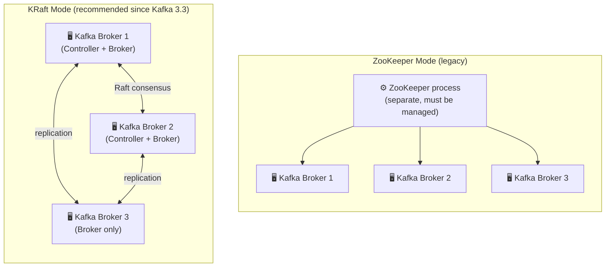
```mermaid
graph TB
    subgraph ZKMode["ZooKeeper Mode  (legacy)"]
        direction TB
        ZK["⚙️ ZooKeeper process\n(separate, must be managed)"]
        ZB1["🖥️ Kafka Broker 1"] 
        ZB2["🖥️ Kafka Broker 2"]
        ZB3["🖥️ Kafka Broker 3"]
        ZK --> ZB1 & ZB2 & ZB3
    end

    subgraph KRMode["KRaft Mode  (recommended since Kafka 3.3)"]
        direction TB
        KC1["🖥️ Kafka Broker 1\n(Controller + Broker)"]
        KC2["🖥️ Kafka Broker 2\n(Controller + Broker)"]
        KC3["🖥️ Kafka Broker 3\n(Broker only)"]
        KC1 <-->|Raft consensus| KC2
        KC1 <-->|replication| KC3
        KC2 <-->|replication| KC3
    end
```

> **Note for this guide**: The Windows setup below uses ZooKeeper mode as it is straightforward for development. For production, consider KRaft mode.

---

## Kafka Architecture

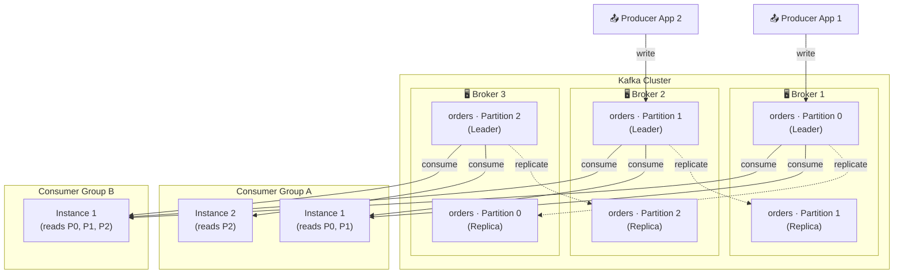
```mermaid
graph TB
    P1["📤 Producer App 1"]
    P2["📤 Producer App 2"]

    subgraph Cluster["Kafka Cluster"]
        subgraph B1["🖥️ Broker 1"]
            direction TB
            B1P0["orders · Partition 0\n(Leader)"]
            B1P1["orders · Partition 1\n(Replica)"]
        end
        subgraph B2["🖥️ Broker 2"]
            direction TB
            B2P1["orders · Partition 1\n(Leader)"]
            B2P2["orders · Partition 2\n(Replica)"]
        end
        subgraph B3["🖥️ Broker 3"]
            direction TB
            B3P2["orders · Partition 2\n(Leader)"]
            B3P0["orders · Partition 0\n(Replica)"]
        end
    end

    subgraph CGA["Consumer Group A"]
        CA1["Instance 1\n(reads P0, P1)"]
        CA2["Instance 2\n(reads P2)"]
    end

    subgraph CGB["Consumer Group B"]
        CB1["Instance 1\n(reads P0, P1, P2)"]
    end

    P1 -->|write| B1P0
    P2 -->|write| B2P1
    B1P0 -.->|replicate| B3P0
    B2P1 -.->|replicate| B1P1
    B3P2 -.->|replicate| B2P2

    B1P0 -->|consume| CA1
    B2P1 -->|consume| CA1
    B3P2 -->|consume| CA2

    B1P0 -->|consume| CB1
    B2P1 -->|consume| CB1
    B3P2 -->|consume| CB1
```

### Message Flow

1. **Producer** sends a message to a Kafka topic (optionally with a key to determine partition)
2. **Broker** receives the message and appends it to the appropriate partition's log
3. **Replicas** on other brokers replicate the partition for fault tolerance
4. **Consumers** in a consumer group pull messages from partitions
5. Each consumer tracks its position (offset) in each partition independently

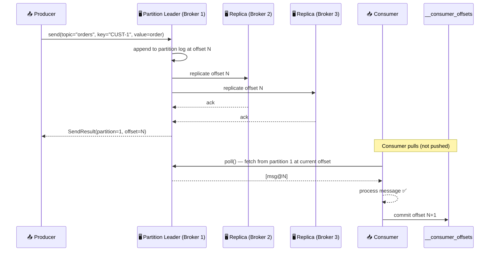
```mermaid
sequenceDiagram
    participant P as 📤 Producer
    participant PB as 🖥️ Partition Leader (Broker 1)
    participant R1 as 🖥️ Replica (Broker 2)
    participant R2 as 🖥️ Replica (Broker 3)
    participant C as 📥 Consumer
    participant CO as __consumer_offsets

    P->>PB: send(topic="orders", key="CUST-1", value=order)
    PB->>PB: append to partition log at offset N
    PB->>R1: replicate offset N
    PB->>R2: replicate offset N
    R1-->>PB: ack
    R2-->>PB: ack
    PB-->>P: SendResult(partition=1, offset=N)

    Note over C,CO: Consumer pulls (not pushed)
    C->>PB: poll() — fetch from partition 1 at current offset
    PB-->>C: [msg@N]
    C-->>C: process message ✅
    C->>CO: commit offset N+1
```

---

## Key Concepts

### Topic

A **topic** is a named category to which producers write and from which consumers read. Topics are analogous to tables in a database or folders in a file system.

- Topics are **split into partitions** for parallel processing
- Topics are **retained on disk** for a configurable duration (default: 7 days)
- A topic can have **multiple producers** and **multiple consumer groups**

### Partition

A **partition** is an ordered, immutable sequence of messages. Each message in a partition has a sequential ID called an **offset**.

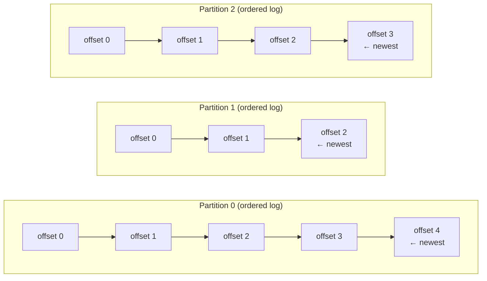
```mermaid
graph LR
    subgraph P0["Partition 0  (ordered log)"]
        direction LR
        p0m0["offset 0"] --> p0m1["offset 1"] --> p0m2["offset 2"] --> p0m3["offset 3"] --> p0m4["offset 4\n← newest"]
    end
    subgraph P1["Partition 1  (ordered log)"]
        direction LR
        p1m0["offset 0"] --> p1m1["offset 1"] --> p1m2["offset 2\n← newest"]
    end
    subgraph P2["Partition 2  (ordered log)"]
        direction LR
        p2m0["offset 0"] --> p2m1["offset 1"] --> p2m2["offset 2"] --> p2m3["offset 3\n← newest"]
    end
```

- Messages within a single partition are **strictly ordered**
- Ordering across partitions is **not guaranteed**
- A message with the same key always goes to the **same partition** (key-based routing)

### Offset

An **offset** is a unique sequential number assigned to each message within a partition. Consumers use offsets to track their position.

- Offsets start at `0` and are always increasing
- Consumers can reset to any past offset to re-read messages
- Offsets are stored in a special Kafka topic: `__consumer_offsets`

### Producer

A **producer** publishes messages to topics. Producers decide:

- **Which topic** to send to
- **Which partition** to target (via key, round-robin, or custom partitioner)
- **Acknowledgement mode** (`acks=0`, `acks=1`, or `acks=all`)

### Consumer

A **consumer** reads messages from topics. Consumers:

- Always belong to a **consumer group**
- Pull messages from the broker (not pushed)
- Track their offset per partition
- Can commit offsets automatically or manually

### Consumer Group

A **consumer group** is a set of consumers that cooperate to consume a topic. Each partition is assigned to exactly one consumer in the group at any time.

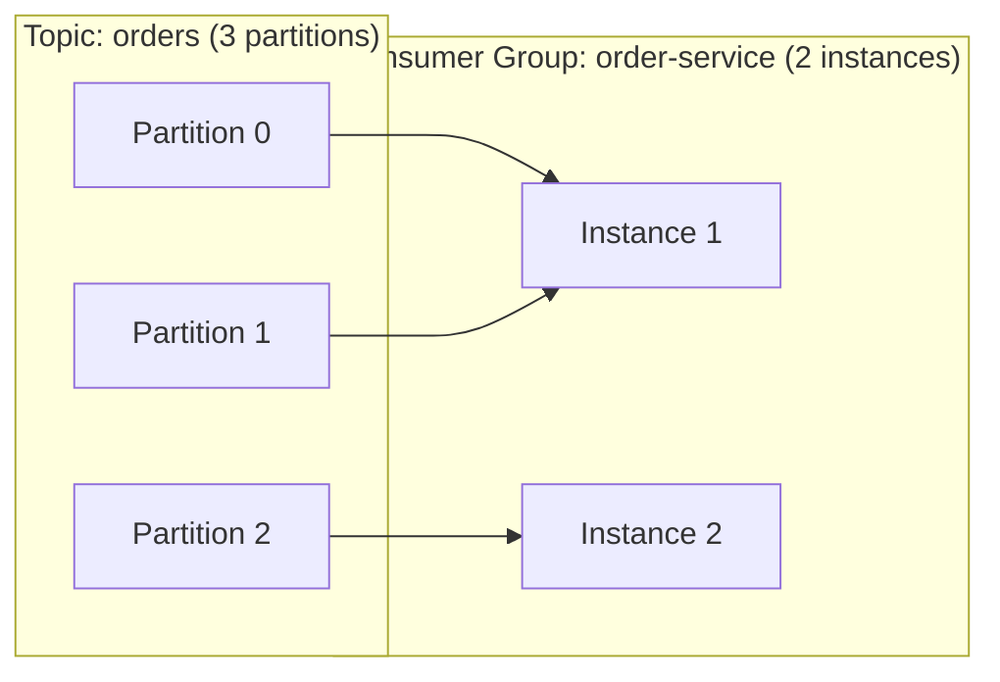
```mermaid
graph LR
    subgraph Topic["Topic: orders  (3 partitions)"]
        P0["Partition 0"]
        P1["Partition 1"]
        P2["Partition 2"]
    end

    subgraph CG["Consumer Group: order-service  (2 instances)"]
        C1["Instance 1"]
        C2["Instance 2"]
    end

    P0 --> C1
    P1 --> C1
    P2 --> C2
```

- If consumers < partitions: some consumers handle multiple partitions
- If consumers = partitions: one consumer per partition (ideal)
- If consumers > partitions: extra consumers sit idle

### Broker

A **broker** is a Kafka server. A Kafka cluster consists of multiple brokers. Brokers:

- Store and serve partition logs
- Handle producer writes and consumer reads
- Replicate partitions across each other for fault tolerance
- One broker serves as the **controller** (cluster metadata manager)

### Replication

Each partition has one **leader** and zero or more **replicas** (followers). Only the leader handles reads and writes. Replicas stay in sync with the leader.

- **Replication factor** of 3 means each partition exists on 3 brokers
- If the leader broker crashes, a follower is automatically elected leader
- **ISR (In-Sync Replicas)**: replicas fully caught up with the leader

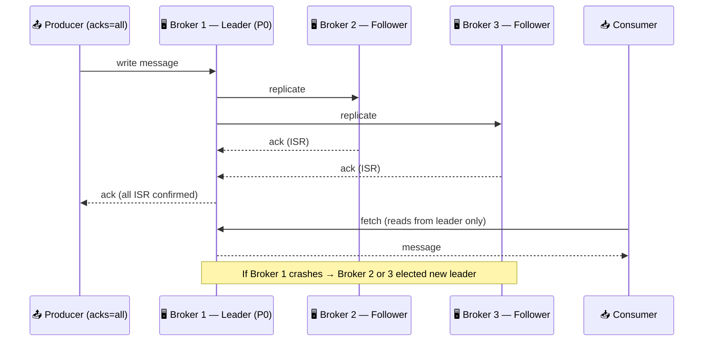
```mermaid
sequenceDiagram
    participant Prod as 📤 Producer (acks=all)
    participant L as 🖥️ Broker 1 — Leader (P0)
    participant F1 as 🖥️ Broker 2 — Follower
    participant F2 as 🖥️ Broker 3 — Follower
    participant Con as 📥 Consumer

    Prod->>L: write message
    L->>F1: replicate
    L->>F2: replicate
    F1-->>L: ack (ISR)
    F2-->>L: ack (ISR)
    L-->>Prod: ack (all ISR confirmed)
    Con->>L: fetch (reads from leader only)
    L-->>Con: message
    Note over L,F2: If Broker 1 crashes → Broker 2 or 3 elected new leader
```

### Retention

Messages are retained on disk for a configurable period, regardless of consumption.

- `log.retention.hours=168` (7 days, default)
- `log.retention.bytes=-1` (unlimited by size, default)
- Retention by time, size, or both

---

## Download and Install Kafka

### Reference Documentation
- [Official Kafka Documentation](https://kafka.apache.org/quickstart)
- [Download Kafka](https://kafka.apache.org/downloads)

### Steps

1. Go to [https://kafka.apache.org/downloads](https://kafka.apache.org/downloads) and download the latest binary release (e.g., `kafka_2.13-3.9.0.tgz`)
2. Extract the archive to a short path to avoid Windows path-length issues:
   ```
   D:\kafka
   ```
3. The extracted folder structure will look like:
   ```
   D:\kafka\
   ├── bin\
   │   └── windows\         ← Windows batch scripts
   ├── config\
   │   ├── zookeeper.properties
   │   └── server.properties
   ├── libs\
   └── logs\
   ```

---

## Starting Kafka on Windows

Kafka requires **two processes** to be running: ZooKeeper first, then the Kafka broker.

### Step 1: Start ZooKeeper

Open a Command Prompt and navigate to the Kafka Windows scripts:

```
cd D:\kafka\bin\windows
```

Start ZooKeeper:

```bat
zookeeper-server-start.bat ..\..\config\zookeeper.properties
```

Leave this CMD window open. You should see output ending with:
```
INFO binding to port 0.0.0.0/0.0.0.0:2181
```

ZooKeeper listens on port **2181** by default.

### Step 2: Start Kafka Broker

Open a **second** Command Prompt:

```
cd D:\kafka\bin\windows
```

Start Kafka:

```bat
kafka-server-start.bat ..\..\config\server.properties
```

Leave this CMD window open too. You should see:
```
INFO [KafkaServer id=0] started
```

Kafka broker listens on port **9092** by default.

### Step 3: Verify Running

Open a third CMD and create a test topic to verify everything works:

```bat
kafka-topics.bat --create --topic test-topic --bootstrap-server localhost:9092 --partitions 1 --replication-factor 1
```

Expected output:
```
Created topic test-topic.
```

### Common Windows Issues

| Problem | Cause | Fix |
|---------|-------|-----|
| `The input line is too long` | Path to Kafka folder is too deep | Move Kafka to `D:\kafka` or `C:\kafka` |
| `java is not recognized` | Java not installed or not in PATH | Install JDK 17+ and add to PATH |
| ZooKeeper fails to start | Port 2181 already in use | Run `netstat -ano \| findstr :2181` and kill the process |
| Kafka fails to start | ZooKeeper not running | Always start ZooKeeper first |
| Old log files causing errors | Previous run left corrupt state | Delete contents of `D:\kafka\logs` and `D:\kafka\kafka-logs` |

---

## Kafka CLI Commands

### Topic Management

```bat
# Create a topic
kafka-topics.bat --create --topic orders --bootstrap-server localhost:9092 --partitions 3 --replication-factor 1

# List all topics
kafka-topics.bat --list --bootstrap-server localhost:9092

# Describe a topic (partitions, replicas, leader info)
kafka-topics.bat --describe --topic orders --bootstrap-server localhost:9092

# Delete a topic
kafka-topics.bat --delete --topic orders --bootstrap-server localhost:9092

# Alter a topic (increase partitions - cannot decrease)
kafka-topics.bat --alter --topic orders --partitions 6 --bootstrap-server localhost:9092
```

### Producing Messages (CLI)

```bat
# Start an interactive producer (type messages, press Enter to send)
kafka-console-producer.bat --topic orders --bootstrap-server localhost:9092

# Send a message with a key (key:value separated by :)
kafka-console-producer.bat --topic orders --bootstrap-server localhost:9092 --property "parse.key=true" --property "key.separator=:"
```

### Consuming Messages (CLI)

```bat
# Consume from the beginning
kafka-console-consumer.bat --topic orders --from-beginning --bootstrap-server localhost:9092

# Consume only new messages
kafka-console-consumer.bat --topic orders --bootstrap-server localhost:9092

# Consume and show keys
kafka-console-consumer.bat --topic orders --from-beginning --bootstrap-server localhost:9092 --property print.key=true --property key.separator=" → "

# Consume as part of a consumer group
kafka-console-consumer.bat --topic orders --bootstrap-server localhost:9092 --group order-service
```

### Consumer Group Management

```bat
# List consumer groups
kafka-consumer-groups.bat --list --bootstrap-server localhost:9092

# Describe a consumer group (offsets, lag)
kafka-consumer-groups.bat --describe --group order-service --bootstrap-server localhost:9092

# Reset consumer group offset to beginning (re-process all messages)
kafka-consumer-groups.bat --reset-offsets --to-earliest --execute --group order-service --topic orders --bootstrap-server localhost:9092
```

---

## Integration with Spring Boot

### Step 1: Add Dependencies

**Maven (`pom.xml`):**

```xml
<dependencies>
    <!-- Spring Boot Kafka Starter (includes spring-kafka) -->
    <dependency>
        <groupId>org.springframework.boot</groupId>
        <artifactId>spring-boot-starter</artifactId>
    </dependency>
    <dependency>
        <groupId>org.springframework.kafka</groupId>
        <artifactId>spring-kafka</artifactId>
    </dependency>

    <!-- For JSON serialization -->
    <dependency>
        <groupId>com.fasterxml.jackson.core</groupId>
        <artifactId>jackson-databind</artifactId>
    </dependency>
</dependencies>
```

**Gradle (`build.gradle`):**

```gradle
dependencies {
    implementation 'org.springframework.boot:spring-boot-starter'
    implementation 'org.springframework.kafka:spring-kafka'
    implementation 'com.fasterxml.jackson.core:jackson-databind'
}
```

### Step 2: Configure Kafka

**`application.properties`:**

```properties
# Broker address
spring.kafka.bootstrap-servers=localhost:9092

# Producer settings
spring.kafka.producer.key-serializer=org.apache.kafka.common.serialization.StringSerializer
spring.kafka.producer.value-serializer=org.springframework.kafka.support.serializer.JsonSerializer
spring.kafka.producer.acks=all
spring.kafka.producer.retries=3

# Consumer settings
spring.kafka.consumer.group-id=my-app-group
spring.kafka.consumer.key-deserializer=org.apache.kafka.common.serialization.StringDeserializer
spring.kafka.consumer.value-deserializer=org.springframework.kafka.support.serializer.JsonDeserializer
spring.kafka.consumer.auto-offset-reset=earliest
spring.kafka.consumer.properties.spring.json.trusted.packages=*
```

**`application.yml`:**

```yaml
spring:
  kafka:
    bootstrap-servers: localhost:9092
    producer:
      key-serializer: org.apache.kafka.common.serialization.StringSerializer
      value-serializer: org.springframework.kafka.support.serializer.JsonSerializer
      acks: all
      retries: 3
    consumer:
      group-id: my-app-group
      key-deserializer: org.apache.kafka.common.serialization.StringDeserializer
      value-deserializer: org.springframework.kafka.support.serializer.JsonDeserializer
      auto-offset-reset: earliest
      properties:
        spring.json.trusted.packages: "*"
```

### Step 3: Kafka Configuration Class

```java
@Configuration
@EnableKafka
public class KafkaConfig {

    @Value("${spring.kafka.bootstrap-servers}")
    private String bootstrapServers;

    @Bean
    public ProducerFactory<String, Object> producerFactory() {
        Map<String, Object> config = new HashMap<>();
        config.put(ProducerConfig.BOOTSTRAP_SERVERS_CONFIG, bootstrapServers);
        config.put(ProducerConfig.KEY_SERIALIZER_CLASS_CONFIG, StringSerializer.class);
        config.put(ProducerConfig.VALUE_SERIALIZER_CLASS_CONFIG, JsonSerializer.class);
        config.put(ProducerConfig.ACKS_CONFIG, "all");
        config.put(ProducerConfig.RETRIES_CONFIG, 3);
        config.put(ProducerConfig.ENABLE_IDEMPOTENCE_CONFIG, true);
        return new DefaultKafkaProducerFactory<>(config);
    }

    @Bean
    public KafkaTemplate<String, Object> kafkaTemplate() {
        return new KafkaTemplate<>(producerFactory());
    }

    @Bean
    public ConsumerFactory<String, Object> consumerFactory() {
        Map<String, Object> config = new HashMap<>();
        config.put(ConsumerConfig.BOOTSTRAP_SERVERS_CONFIG, bootstrapServers);
        config.put(ConsumerConfig.GROUP_ID_CONFIG, "my-app-group");
        config.put(ConsumerConfig.KEY_DESERIALIZER_CLASS_CONFIG, StringDeserializer.class);
        config.put(ConsumerConfig.VALUE_DESERIALIZER_CLASS_CONFIG, JsonDeserializer.class);
        config.put(ConsumerConfig.AUTO_OFFSET_RESET_CONFIG, "earliest");
        config.put(JsonDeserializer.TRUSTED_PACKAGES, "*");
        return new DefaultKafkaConsumerFactory<>(config);
    }

    @Bean
    public ConcurrentKafkaListenerContainerFactory<String, Object> kafkaListenerContainerFactory() {
        ConcurrentKafkaListenerContainerFactory<String, Object> factory =
            new ConcurrentKafkaListenerContainerFactory<>();
        factory.setConsumerFactory(consumerFactory());
        factory.setConcurrency(3);
        return factory;
    }

    @Bean
    public NewTopic ordersTopic() {
        return TopicBuilder.name("orders")
                .partitions(3)
                .replicas(1)
                .build();
    }
}
```

---

## Producers

### Basic Producer

```java
@Service
public class OrderProducer {

    private static final Logger logger = LoggerFactory.getLogger(OrderProducer.class);

    @Autowired
    private KafkaTemplate<String, Object> kafkaTemplate;

    private static final String TOPIC = "orders";

    // Send without a key (round-robin partition assignment)
    public void sendOrder(Order order) {
        kafkaTemplate.send(TOPIC, order);
        logger.info("Sent order: {}", order.getOrderId());
    }

    // Send with a key (same key always goes to same partition)
    public void sendOrderWithKey(Order order) {
        kafkaTemplate.send(TOPIC, order.getCustomerId(), order);
        logger.info("Sent order {} for customer {}", order.getOrderId(), order.getCustomerId());
    }

    // Send to a specific partition
    public void sendToPartition(Order order, int partition) {
        kafkaTemplate.send(TOPIC, partition, order.getCustomerId(), order);
    }
}
```

### Producer with Callbacks

```java
@Service
public class OrderProducerWithCallback {

    @Autowired
    private KafkaTemplate<String, Object> kafkaTemplate;

    public void sendOrder(Order order) {
        CompletableFuture<SendResult<String, Object>> future =
            kafkaTemplate.send("orders", order.getOrderId(), order);

        future.whenComplete((result, ex) -> {
            if (ex == null) {
                RecordMetadata metadata = result.getRecordMetadata();
                logger.info("Sent order to topic={} partition={} offset={}",
                    metadata.topic(),
                    metadata.partition(),
                    metadata.offset());
            } else {
                logger.error("Failed to send order {}: {}", order.getOrderId(), ex.getMessage());
            }
        });
    }
}
```

### Producer Acknowledgement Modes (`acks`)

| `acks` Value | Behavior | Risk | Speed |
|-------------|----------|------|-------|
| `0` | Fire and forget — no acknowledgement from broker | Message can be lost | Fastest |
| `1` | Leader writes to local log, acknowledges | Message lost if leader crashes before replication | Medium |
| `all` (-1) | All in-sync replicas acknowledge | No data loss | Slowest (safest) |

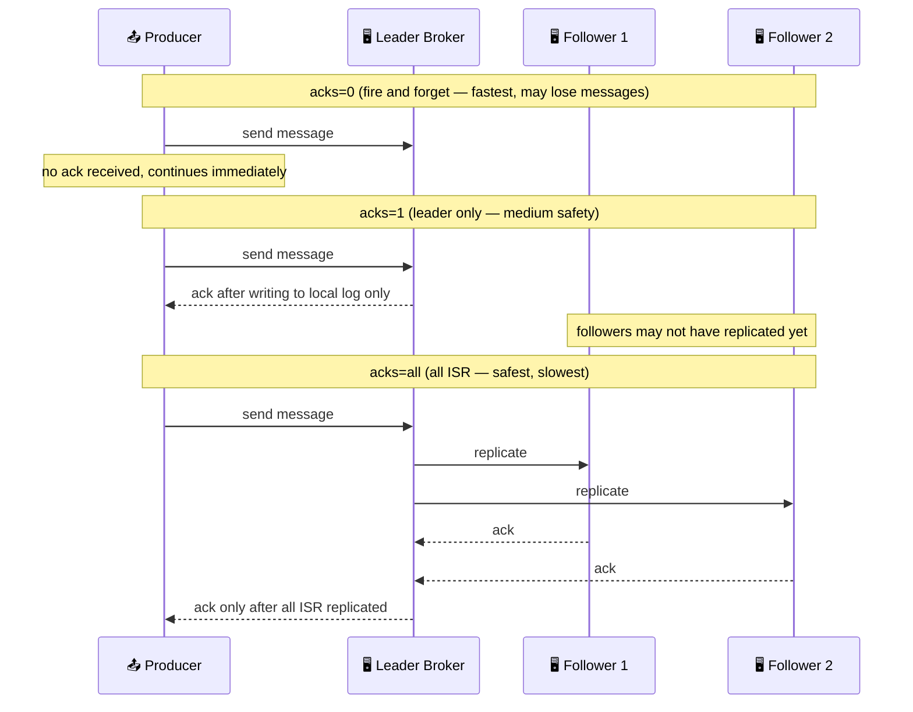
```mermaid
sequenceDiagram
    participant P as 📤 Producer
    participant L as 🖥️ Leader Broker
    participant F1 as 🖥️ Follower 1
    participant F2 as 🖥️ Follower 2

    Note over P,F2: acks=0  (fire and forget — fastest, may lose messages)
    P->>L: send message
    Note over P: no ack received, continues immediately

    Note over P,F2: acks=1  (leader only — medium safety)
    P->>L: send message
    L-->>P: ack after writing to local log only
    Note over F1,F2: followers may not have replicated yet

    Note over P,F2: acks=all  (all ISR — safest, slowest)
    P->>L: send message
    L->>F1: replicate
    L->>F2: replicate
    F1-->>L: ack
    F2-->>L: ack
    L-->>P: ack only after all ISR replicated
```

```properties
# Strongest guarantee - use for critical data
spring.kafka.producer.acks=all

# Weakest but fastest - only for non-critical events
spring.kafka.producer.acks=0
```

### Idempotent Producer

With idempotent producers enabled, Kafka guarantees exactly-once delivery per producer session even on retries:

```java
config.put(ProducerConfig.ENABLE_IDEMPOTENCE_CONFIG, true);
config.put(ProducerConfig.ACKS_CONFIG, "all");        // required with idempotence
config.put(ProducerConfig.RETRIES_CONFIG, Integer.MAX_VALUE);
config.put(ProducerConfig.MAX_IN_FLIGHT_REQUESTS_PER_CONNECTION, 5);
```

### Sending with Custom Headers

```java
public void sendOrderWithHeaders(Order order, String traceId) {
    ProducerRecord<String, Object> record = new ProducerRecord<>(
        "orders", null, order.getOrderId(), order
    );
    record.headers().add("traceId", traceId.getBytes(StandardCharsets.UTF_8));
    record.headers().add("source", "web-checkout".getBytes(StandardCharsets.UTF_8));

    kafkaTemplate.send(record);
}
```

---

## KafkaTemplate — All Methods Explained

### What is KafkaTemplate?

`KafkaTemplate` is Spring Kafka's high-level producer abstraction. It wraps the raw `KafkaProducer` API and provides:

- Thread-safe message sending
- Automatic serialization via configured serializers
- `CompletableFuture`-based async callbacks
- Transaction support
- Spring Messaging integration (`Message<?>` objects)
- Observability hooks (Micrometer)

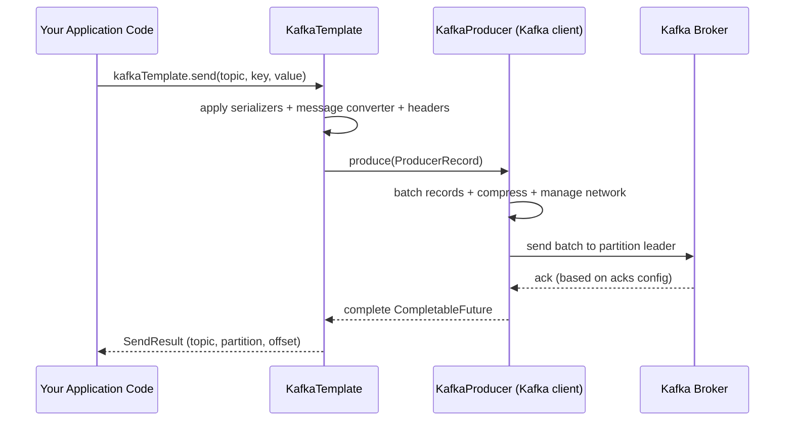
```mermaid
sequenceDiagram
    participant App as Your Application Code
    participant KT as KafkaTemplate
    participant KP as KafkaProducer (Kafka client)
    participant B as Kafka Broker

    App->>KT: kafkaTemplate.send(topic, key, value)
    KT->>KT: apply serializers + message converter + headers
    KT->>KP: produce(ProducerRecord)
    KP->>KP: batch records + compress + manage network
    KP->>B: send batch to partition leader
    B-->>KP: ack (based on acks config)
    KP-->>KT: complete CompletableFuture
    KT-->>App: SendResult (topic, partition, offset)
```

---

### Is KafkaTemplate Pub-Sub or Point-to-Point?

**Kafka is purely publish-subscribe.** There is no point-to-point queue concept in Kafka the way ActiveMQ has queues.

- Every message goes to a **topic**
- A topic can have **many consumer groups**, and every group independently receives every message — this is pub-sub
- Within a single consumer group, each message is delivered to **only one consumer instance** — this mimics point-to-point

**Scenario A — Pub-Sub (multiple independent consumer groups, each receives all messages):**

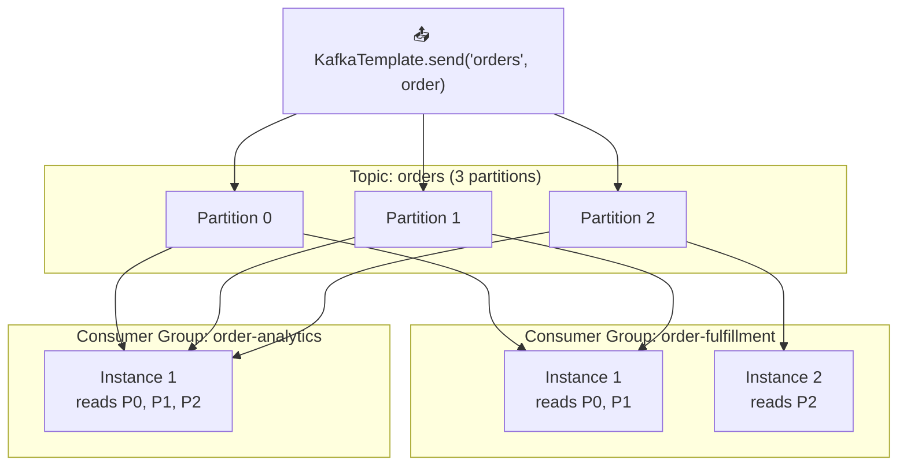
```mermaid
graph TB
    Prod["📤 KafkaTemplate.send('orders', order)"]

    subgraph Topic["Topic: orders  (3 partitions)"]
        P0["Partition 0"]
        P1["Partition 1"]
        P2["Partition 2"]
    end

    subgraph GRP1["Consumer Group: order-fulfillment"]
        GRP1A["Instance 1\nreads P0, P1"]
        GRP1B["Instance 2\nreads P2"]
    end

    subgraph GRP2["Consumer Group: order-analytics"]
        GRP2A["Instance 1\nreads P0, P1, P2"]
    end

    Prod --> P0
    Prod --> P1
    Prod --> P2

    P0 --> GRP1A
    P1 --> GRP1A
    P2 --> GRP1B

    P0 --> GRP2A
    P1 --> GRP2A
    P2 --> GRP2A
```

**Scenario B — Point-to-Point simulation (single consumer group, each message goes to exactly one instance):**

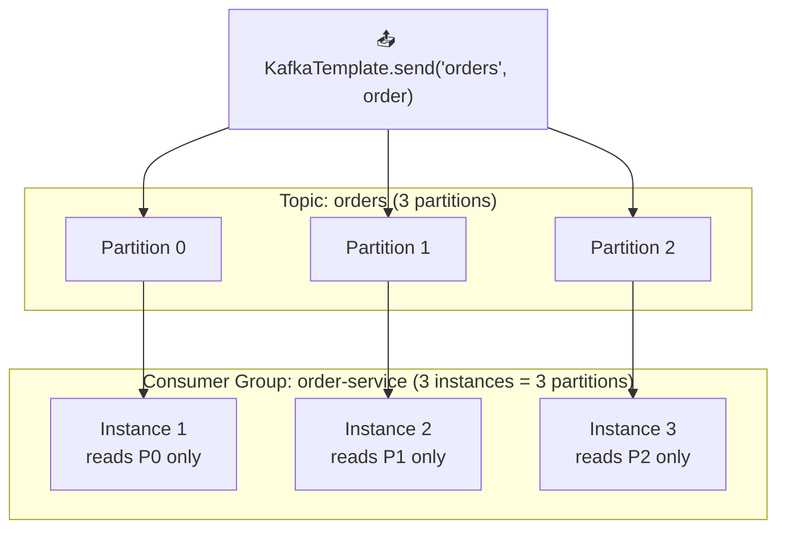
```mermaid
graph TB
    Prod["📤 KafkaTemplate.send('orders', order)"]

    subgraph Topic["Topic: orders  (3 partitions)"]
        P0["Partition 0"]
        P1["Partition 1"]
        P2["Partition 2"]
    end

    subgraph GRP["Consumer Group: order-service  (3 instances = 3 partitions)"]
        C1["Instance 1\nreads P0 only"]
        C2["Instance 2\nreads P1 only"]
        C3["Instance 3\nreads P2 only"]
    end

    Prod --> P0
    Prod --> P1
    Prod --> P2
    P0 --> C1
    P1 --> C2
    P2 --> C3
```

**KafkaTemplate** is used **only to publish to topics**. It has no concept of sending to a specific consumer — the broker handles delivery to all interested consumer groups.

| Pattern | How to Achieve in Kafka |
|---------|------------------------|
| Pub-Sub (broadcast) | Multiple consumer groups subscribe to the same topic |
| Point-to-Point (one receiver) | Single consumer group with one instance per partition |
| Fanout | Topic with multiple consumer groups |
| Load balancing | One consumer group with multiple instances |

---

### All KafkaTemplate Methods

#### 1. `send(String topic, V value)` — No Key, No Partition

Sends to the topic. Partition is assigned **round-robin** across all available partitions (since there is no key).

```java
// Round-robin across partitions — no ordering guarantee
kafkaTemplate.send("orders", order);
```

Use when: message ordering does not matter and you want maximum throughput spread.

---

#### 2. `send(String topic, K key, V value)` — With Key

Sends with a **message key**. The same key always routes to the **same partition**, guaranteeing ordering for messages sharing a key.

```java
// All orders for the same customer go to the same partition
// → customer's orders are processed in the order they were sent
kafkaTemplate.send("orders", order.getCustomerId(), order);
```

Use when: you need ordering per business entity (customer, account, session, etc.).

**How key-to-partition assignment works:**

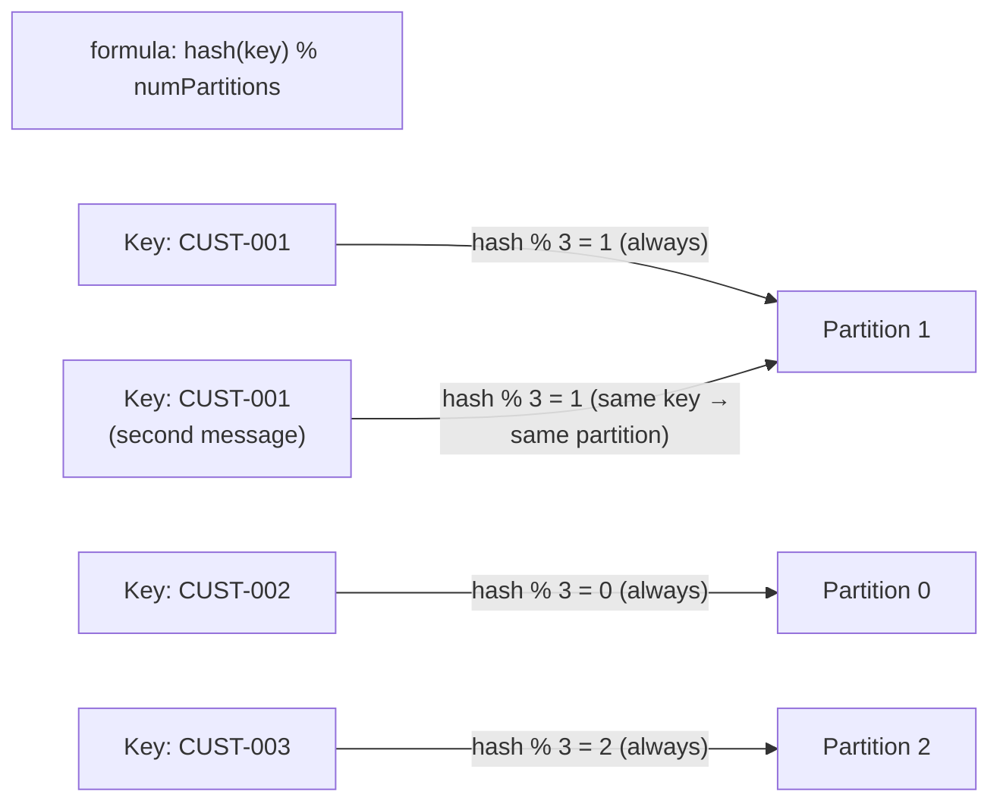
```mermaid
graph LR
    F["formula: hash(key) % numPartitions"]

    K1["Key: CUST-001"] -->|"hash % 3 = 1 (always)"| P1["Partition 1"]
    K2["Key: CUST-002"] -->|"hash % 3 = 0 (always)"| P0["Partition 0"]
    K3["Key: CUST-003"] -->|"hash % 3 = 2 (always)"| P2["Partition 2"]
    K4["Key: CUST-001\n(second message)"] -->|"hash % 3 = 1 (same key → same partition)"| P1
```

---

#### 3. `send(String topic, Integer partition, K key, V value)` — Specific Partition

Sends directly to a **named partition**, bypassing the partitioner entirely.

```java
// Force-send to partition 2 (e.g. for a specific region's dedicated partition)
kafkaTemplate.send("orders", 2, order.getCustomerId(), order);
```

Use when: you manually manage partition assignment (e.g., geographic sharding).

---

#### 4. `send(String topic, Integer partition, Long timestamp, K key, V value)` — With Custom Timestamp

Sends with a **custom event timestamp** instead of the broker's wall-clock time. Useful for replaying historical events or maintaining event-time semantics in stream processing.

```java
long eventTime = order.getCreatedAt()
                      .toInstant(ZoneOffset.UTC)
                      .toEpochMilli();

kafkaTemplate.send("orders", 0, eventTime, order.getOrderId(), order);
```

Use when: you need the Kafka timestamp to reflect the actual business event time, not the time of sending.

---

#### 5. `send(ProducerRecord<K, V> record)` — Raw ProducerRecord (Most Flexible)

Sends a fully constructed `ProducerRecord`. This gives you the most control — partition, timestamp, headers, key, and value all in one object.

```java
ProducerRecord<String, Order> record = new ProducerRecord<>(
    "orders",               // topic
    2,                      // partition (null = use partitioner)
    System.currentTimeMillis(),  // timestamp
    order.getCustomerId(),  // key
    order                   // value
);

// Add custom headers
record.headers().add("traceId",  traceId.getBytes(StandardCharsets.UTF_8));
record.headers().add("source",   "checkout-service".getBytes(StandardCharsets.UTF_8));
record.headers().add("version",  "v2".getBytes(StandardCharsets.UTF_8));

kafkaTemplate.send(record);
```

Use when: you need to set custom headers, a specific timestamp, or a specific partition simultaneously.

---

#### 6. `send(Message<?> message)` — Spring Messaging Integration

Sends a Spring `Message<?>` object. Spring Kafka extracts topic, partition, key, and headers from the message's `MessageHeaders`.

```java
import org.springframework.messaging.Message;
import org.springframework.messaging.support.MessageBuilder;
import org.springframework.kafka.support.KafkaHeaders;

Message<Order> message = MessageBuilder
    .withPayload(order)
    .setHeader(KafkaHeaders.TOPIC, "orders")
    .setHeader(KafkaHeaders.KEY, order.getCustomerId())
    .setHeader(KafkaHeaders.PARTITION, 1)
    .setHeader("traceId", traceId)
    .setHeader("source", "checkout-service")
    .build();

kafkaTemplate.send(message);
```

Use when: working with Spring Integration or Spring Cloud Stream pipelines where messages are already wrapped in `Message<?>`.

**Common `KafkaHeaders` constants used with `Message<?>`:**

| Header Constant | Sets |
|----------------|------|
| `KafkaHeaders.TOPIC` | Destination topic |
| `KafkaHeaders.KEY` | Message key |
| `KafkaHeaders.PARTITION` | Target partition |
| `KafkaHeaders.TIMESTAMP` | Message timestamp |

---

#### 7. `sendDefault(V value)` — Send to Default Topic

Sends to the **default topic** configured via `spring.kafka.template.default-topic` or `kafkaTemplate.setDefaultTopic(...)`.

```properties
spring.kafka.template.default-topic=orders
```

```java
// No need to specify topic every time
kafkaTemplate.sendDefault(order);
kafkaTemplate.sendDefault(order.getCustomerId(), order);
kafkaTemplate.sendDefault(1, order.getCustomerId(), order);
kafkaTemplate.sendDefault(1, System.currentTimeMillis(), order.getCustomerId(), order);
```

All the same overloads as `send()` exist for `sendDefault()`, minus the topic parameter.

Use when: your service only ever publishes to one topic.

---

#### 8. `executeInTransaction(OperationsCallback<K, V, T> callback)` — Transactional Send

Executes multiple `send()` calls atomically within a **Kafka transaction**. Either all messages are committed or none are.

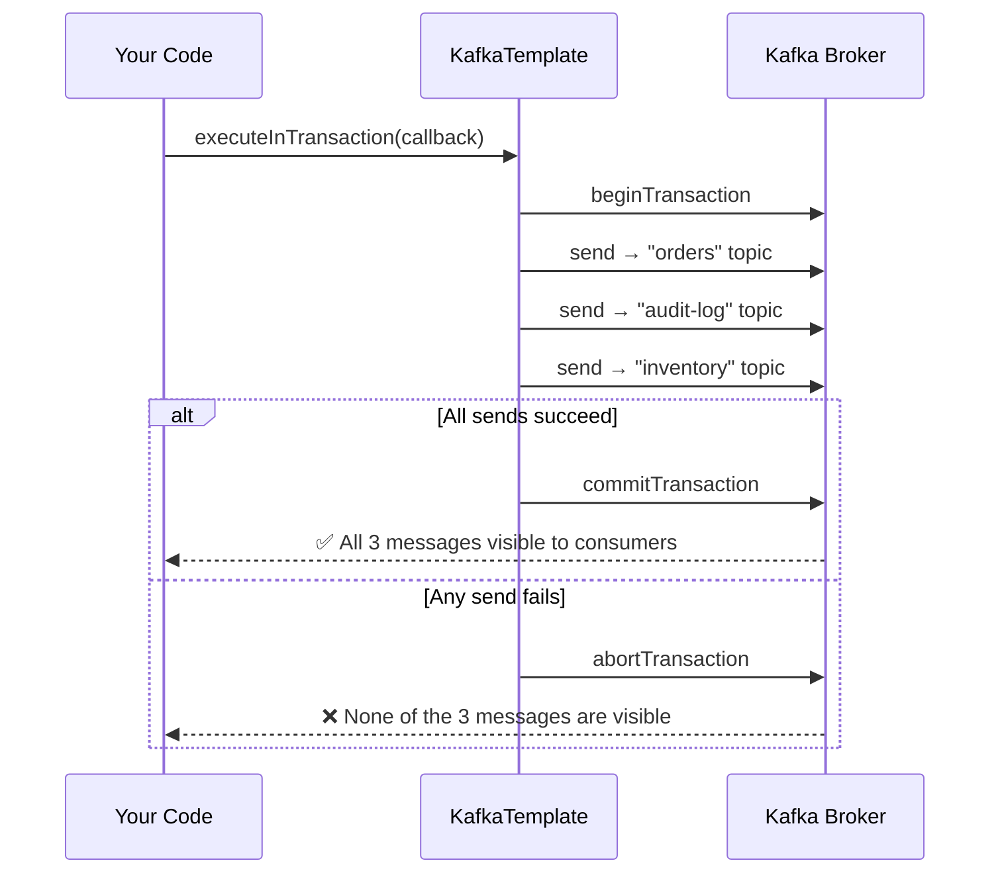
```mermaid
sequenceDiagram
    participant App as Your Code
    participant KT as KafkaTemplate
    participant B as Kafka Broker

    App->>KT: executeInTransaction(callback)
    KT->>B: beginTransaction
    KT->>B: send → "orders" topic
    KT->>B: send → "audit-log" topic
    KT->>B: send → "inventory" topic

    alt All sends succeed
        KT->>B: commitTransaction
        B-->>App: ✅ All 3 messages visible to consumers
    else Any send fails
        KT->>B: abortTransaction
        B-->>App: ❌ None of the 3 messages are visible
    end
```

```java
kafkaTemplate.executeInTransaction(operations -> {
    operations.send("orders",   order.getCustomerId(),  order);
    operations.send("audit-log", order.getOrderId(),   auditEntry);
    operations.send("inventory", order.getProductId(), inventoryReservation);
    return true;
    // All 3 messages committed atomically — or none if an exception occurs
});
```

Requires `transactional-id` to be set on the producer factory:

```java
config.put(ProducerConfig.TRANSACTIONAL_ID_CONFIG, "order-tx-1");
```

Use when: you must publish to multiple topics as a single atomic unit (e.g., order + audit + inventory in one transaction).

---

#### 9. `flush()` — Force-Send Buffered Messages

Kafka producers buffer messages in memory and send them in **batches** for throughput. `flush()` forces all buffered messages to be sent immediately, blocking until all sends complete.

```java
kafkaTemplate.send("orders", order1);
kafkaTemplate.send("orders", order2);
kafkaTemplate.send("orders", order3);

// Force all 3 to be sent now — don't wait for batch to fill up
kafkaTemplate.flush();
// After this line, all 3 messages are on the broker
```

Use when: you need guaranteed delivery before proceeding (e.g., during application shutdown, or before a batch job reports completion).

---

### Return Value: `CompletableFuture<SendResult<K, V>>`

Every `send()` method returns `CompletableFuture<SendResult<K, V>>`. You can handle the result asynchronously or block synchronously.

```java
// Async — do not block the calling thread
CompletableFuture<SendResult<String, Order>> future =
    kafkaTemplate.send("orders", order.getCustomerId(), order);

future.whenComplete((result, ex) -> {
    if (ex == null) {
        RecordMetadata meta = result.getRecordMetadata();
        logger.info("Sent to topic={} partition={} offset={}",
            meta.topic(), meta.partition(), meta.offset());
    } else {
        logger.error("Send failed for order {}: {}", order.getOrderId(), ex.getMessage());
    }
});
```

```java
// Sync — block until broker confirms (use only when you need guaranteed delivery before proceeding)
try {
    SendResult<String, Order> result =
        kafkaTemplate.send("orders", order.getCustomerId(), order).get();

    logger.info("Confirmed at offset {}", result.getRecordMetadata().offset());
} catch (ExecutionException | InterruptedException e) {
    logger.error("Send failed", e);
}
```

**`SendResult<K, V>` contains:**

| Method | Returns |
|--------|---------|
| `getRecordMetadata()` | `RecordMetadata` — topic, partition, offset, timestamp |
| `getProducerRecord()` | The `ProducerRecord` that was sent (key, value, headers) |

---

### Complete `KafkaTemplate` Method Reference

| Method Signature | Key | Partition | Timestamp | Headers | Use Case |
|-----------------|-----|-----------|-----------|---------|----------|
| `send(topic, value)` | No | Auto | Auto | No | Fire-and-forget, max spread |
| `send(topic, key, value)` | Yes | By key | Auto | No | Ordering per key |
| `send(topic, partition, key, value)` | Yes | Fixed | Auto | No | Manual sharding |
| `send(topic, partition, timestamp, key, value)` | Yes | Fixed | Custom | No | Event-time replay |
| `send(ProducerRecord)` | Yes | Fixed | Custom | **Yes** | Full control |
| `send(Message<?>)` | Via header | Via header | Via header | **Yes** | Spring Integration |
| `sendDefault(value)` | No | Auto | Auto | No | Single-topic services |
| `sendDefault(key, value)` | Yes | By key | Auto | No | Ordering, single-topic |
| `sendDefault(partition, key, value)` | Yes | Fixed | Auto | No | Sharding, single-topic |
| `sendDefault(partition, timestamp, key, value)` | Yes | Fixed | Custom | No | Replay, single-topic |
| `executeInTransaction(callback)` | — | — | — | — | Atomic multi-topic sends |
| `flush()` | — | — | — | — | Force-send batched messages |

---

### KafkaTemplate vs JmsTemplate (ActiveMQ)

| Feature | `KafkaTemplate` | `JmsTemplate` (ActiveMQ) |
|---------|----------------|--------------------------|
| Destination type | **Topic only** | Queue OR Topic |
| Point-to-point | Not directly (use consumer groups) | Yes — native queue support |
| Pub-sub | Yes — all consumer groups receive | Yes — with `setPubSubDomain(true)` |
| Request-reply | Not built-in | `convertSendAndReceive()` |
| Transaction | `executeInTransaction()` | `@Transactional` / `SESSION_TRANSACTED` |
| Async send result | `CompletableFuture<SendResult>` | No built-in callback |
| Custom headers | Via `ProducerRecord.headers()` or `Message<?>` | Via `MessagePostProcessor` |
| Default destination | `sendDefault()` | `setDefaultDestinationName()` |

---

## Consumers

### Basic Consumer

```java
@Service
public class OrderConsumer {

    private static final Logger logger = LoggerFactory.getLogger(OrderConsumer.class);

    @KafkaListener(topics = "orders", groupId = "order-service")
    public void consume(Order order) {
        logger.info("Received order: {}", order.getOrderId());
        processOrder(order);
    }
}
```

### Consumer with Full Metadata

```java
@KafkaListener(topics = "orders", groupId = "order-service")
public void consume(
        @Payload Order order,
        @Header(KafkaHeaders.RECEIVED_TOPIC) String topic,
        @Header(KafkaHeaders.RECEIVED_PARTITION) int partition,
        @Header(KafkaHeaders.OFFSET) long offset,
        @Header(KafkaHeaders.RECEIVED_KEY) String key,
        @Header(KafkaHeaders.RECEIVED_TIMESTAMP) long timestamp
) {
    logger.info("Received from topic={} partition={} offset={} key={}",
        topic, partition, offset, key);
    processOrder(order);
}
```

### Consumer with Raw ConsumerRecord

```java
@KafkaListener(topics = "orders", groupId = "order-service")
public void consume(ConsumerRecord<String, Order> record) {
    String key = record.key();
    Order order = record.value();
    int partition = record.partition();
    long offset = record.offset();
    long timestamp = record.timestamp();

    // Read custom headers
    Header traceIdHeader = record.headers().lastHeader("traceId");
    String traceId = traceIdHeader != null
        ? new String(traceIdHeader.value(), StandardCharsets.UTF_8)
        : "unknown";

    logger.info("[traceId={}] Processing order {} at partition={} offset={}",
        traceId, order.getOrderId(), partition, offset);
    processOrder(order);
}
```

### Offset Commit Modes

The **offset commit** tells Kafka how far the consumer has read. There are two main modes:

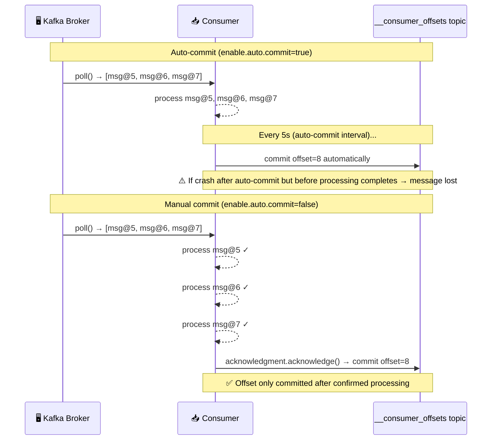
```mermaid
sequenceDiagram
    participant K as 🖥️ Kafka Broker
    participant C as 📥 Consumer
    participant CO as __consumer_offsets topic

    Note over K,CO: Auto-commit (enable.auto.commit=true)
    K->>C: poll() → [msg@5, msg@6, msg@7]
    C-->>C: process msg@5, msg@6, msg@7
    Note over C,CO: Every 5s (auto-commit interval)...
    C->>CO: commit offset=8 automatically
    Note over C,CO: ⚠️ If crash after auto-commit but before processing completes → message lost

    Note over K,CO: Manual commit (enable.auto.commit=false)
    K->>C: poll() → [msg@5, msg@6, msg@7]
    C-->>C: process msg@5 ✓
    C-->>C: process msg@6 ✓
    C-->>C: process msg@7 ✓
    C->>CO: acknowledgment.acknowledge() → commit offset=8
    Note over C,CO: ✅ Offset only committed after confirmed processing
```

| Mode | Setting | When Offset is Committed |
|------|---------|--------------------------|
| Auto-commit | `enable.auto.commit=true` | Periodically, on a timer (default every 5 seconds) |
| Manual commit | `enable.auto.commit=false` | When your code explicitly calls `acknowledge()` |

#### Auto-Commit (Default)

```properties
spring.kafka.consumer.enable-auto-commit=true
spring.kafka.consumer.auto-commit-interval=5000
```

Auto-commit commits the offset after `auto-commit-interval` ms regardless of whether processing succeeded. This can cause **message loss** if the app crashes after auto-commit but before successful processing.

#### Manual Commit (Recommended for Reliable Processing)

```java
@Configuration
@EnableKafka
public class KafkaConfig {

    @Bean
    public ConcurrentKafkaListenerContainerFactory<String, Object> kafkaListenerContainerFactory() {
        ConcurrentKafkaListenerContainerFactory<String, Object> factory =
            new ConcurrentKafkaListenerContainerFactory<>();
        factory.setConsumerFactory(consumerFactory());
        factory.getContainerProperties().setAckMode(ContainerProperties.AckMode.MANUAL);
        return factory;
    }
}
```

```java
@KafkaListener(topics = "orders", groupId = "order-service")
public void consume(Order order, Acknowledgment acknowledgment) {
    try {
        processOrder(order);
        acknowledgment.acknowledge();  // commit offset only after successful processing
    } catch (Exception e) {
        logger.error("Failed to process order {}", order.getOrderId(), e);
        // Do NOT acknowledge — message will be redelivered on consumer restart
    }
}
```

#### Acknowledgement Modes

| Mode | Behavior |
|------|----------|
| `RECORD` | Commit after each record is processed |
| `BATCH` | Commit after all records in a poll batch are processed |
| `MANUAL` | Commit when `acknowledgment.acknowledge()` is called |
| `MANUAL_IMMEDIATE` | Commit immediately (synchronous) when `acknowledge()` is called |
| `COUNT` | Commit after N records are processed |
| `TIME` | Commit on a time interval |
| `COUNT_TIME` | Commit when either count or time threshold is reached |

---

## Consumer Groups

Consumer groups allow multiple application instances to cooperate in consuming a topic, providing both **scalability** and **fault tolerance**.

### How Rebalancing Works

When a consumer in a group joins or leaves (or crashes), Kafka triggers a **rebalance** — redistributing partitions among the remaining consumers.

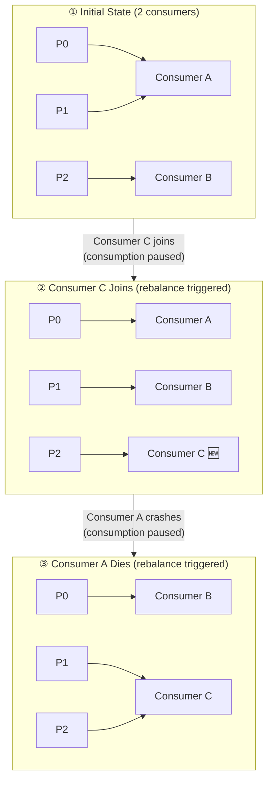
```mermaid
graph TB
    subgraph S1["① Initial State  (2 consumers)"]
        direction LR
        s1p0["P0"] --> s1ca["Consumer A"]
        s1p1["P1"] --> s1ca
        s1p2["P2"] --> s1cb["Consumer B"]
    end

    subgraph S2["② Consumer C Joins  (rebalance triggered)"]
        direction LR
        s2p0["P0"] --> s2ca["Consumer A"]
        s2p1["P1"] --> s2cb["Consumer B"]
        s2p2["P2"] --> s2cc["Consumer C  🆕"]
    end

    subgraph S3["③ Consumer A Dies  (rebalance triggered)"]
        direction LR
        s3p0["P0"] --> s3cb["Consumer B"]
        s3p1["P1"] --> s3cc["Consumer C"]
        s3p2["P2"] --> s3cc
    end

    S1 -->|"Consumer C joins\n(consumption paused)"| S2
    S2 -->|"Consumer A crashes\n(consumption paused)"| S3
```

During a rebalance, **consumption is paused** for the entire group. For low-latency applications, use **Static Group Membership** to reduce rebalance frequency:

```properties
spring.kafka.consumer.group-instance-id=instance-1
spring.kafka.consumer.session-timeout-ms=30000
```

### Multiple Consumer Groups

Different consumer groups independently consume the same topic. Each group maintains its own set of offsets:

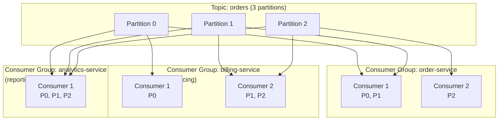
```mermaid
graph TB
    subgraph Topic["Topic: orders  (3 partitions)"]
        P0["Partition 0"]
        P1["Partition 1"]
        P2["Partition 2"]
    end

    subgraph GRP1["Consumer Group: order-service\n(fulfillment)"]
        G1C1["Consumer 1\nP0, P1"]
        G1C2["Consumer 2\nP2"]
    end

    subgraph GRP2["Consumer Group: billing-service\n(invoicing)"]
        G2C1["Consumer 1\nP0"]
        G2C2["Consumer 2\nP1, P2"]
    end

    subgraph GRP3["Consumer Group: analytics-service\n(reporting)"]
        G3C1["Consumer 1\nP0, P1, P2"]
    end

    P0 --> G1C1
    P1 --> G1C1
    P2 --> G1C2

    P0 --> G2C1
    P1 --> G2C2
    P2 --> G2C2

    P0 --> G3C1
    P1 --> G3C1
    P2 --> G3C1
```

### Concurrency in Spring Kafka

```java
// 3 consumer threads within the same JVM process
@KafkaListener(topics = "orders", groupId = "order-service", concurrency = "3")
public void consume(Order order) {
    processOrder(order);
}
```

Or configure globally:

```java
factory.setConcurrency(3);
```

Each thread handles one partition. Setting `concurrency` higher than the number of partitions wastes resources.

---

## Topics and Partitions

### Creating Topics Programmatically

```java
@Configuration
public class TopicConfig {

    @Bean
    public NewTopic ordersTopic() {
        return TopicBuilder.name("orders")
                .partitions(3)
                .replicas(1)
                .config(TopicConfig.RETENTION_MS_CONFIG, String.valueOf(7 * 24 * 60 * 60 * 1000L)) // 7 days
                .build();
    }

    @Bean
    public NewTopic notificationsTopic() {
        return TopicBuilder.name("notifications")
                .partitions(6)
                .replicas(1)
                .compact()  // log compaction: keep only latest value per key
                .build();
    }
}
```

### Partition Key Strategy

Choosing the right **message key** is critical for ordering and load distribution:

```java
// Group by customer — all orders from the same customer go to the same partition
// This guarantees ordering of orders per customer
kafkaTemplate.send("orders", order.getCustomerId(), order);

// Group by region
kafkaTemplate.send("orders", order.getRegion(), order);

// No key — round-robin across all partitions (maximum throughput, no ordering)
kafkaTemplate.send("orders", order);
```

### Listening to Specific Partitions

```java
// Listen to only partition 0 and 1 of a topic
@KafkaListener(
    topicPartitions = @TopicPartition(
        topic = "orders",
        partitions = {"0", "1"}
    ),
    groupId = "order-service"
)
public void consumeSpecificPartitions(Order order) {
    processOrder(order);
}

// Listen from a specific offset
@KafkaListener(
    topicPartitions = @TopicPartition(
        topic = "orders",
        partitionOffsets = {
            @PartitionOffset(partition = "0", initialOffset = "100"),
            @PartitionOffset(partition = "1", initialOffset = "0")
        }
    ),
    groupId = "order-service-replay"
)
public void consumeFromOffset(Order order) {
    processOrder(order);
}
```

### Log Compaction

Log compaction keeps only the **latest message per key**, discarding older messages with the same key. This is useful for maintaining a changelog or state store:

```java
@Bean
public NewTopic userProfilesTopic() {
    return TopicBuilder.name("user-profiles")
            .partitions(3)
            .replicas(1)
            .compact()
            .build();
}

// Send a user profile update (latest value for each userId is retained)
kafkaTemplate.send("user-profiles", userId, userProfile);

// Delete a user profile (tombstone message: key with null value)
kafkaTemplate.send(new ProducerRecord<>("user-profiles", userId, null));
```

---

## Message Serialization

### Default: String Serialization

```properties
spring.kafka.producer.value-serializer=org.apache.kafka.common.serialization.StringSerializer
spring.kafka.consumer.value-deserializer=org.apache.kafka.common.serialization.StringDeserializer
```

### JSON Serialization (Recommended for DTOs)

```properties
spring.kafka.producer.value-serializer=org.springframework.kafka.support.serializer.JsonSerializer
spring.kafka.consumer.value-deserializer=org.springframework.kafka.support.serializer.JsonDeserializer
spring.kafka.consumer.properties.spring.json.trusted.packages=com.example.model
spring.kafka.consumer.properties.spring.json.value.default.type=com.example.model.Order
```

For sending multiple different types on the same topic, the `JsonSerializer` automatically adds a type header:

```java
@Bean
public ConsumerFactory<String, Object> consumerFactory() {
    JsonDeserializer<Object> deserializer = new JsonDeserializer<>();
    deserializer.addTrustedPackages("com.example.model");
    deserializer.setUseTypeMapperForKey(false);

    // Map type header values to concrete classes
    deserializer.setTypeMapping(
        "order", Order.class,
        "payment", Payment.class
    );

    return new DefaultKafkaConsumerFactory<>(
        kafkaProperties(),
        new StringDeserializer(),
        deserializer
    );
}
```

### Custom Serializer / Deserializer

```java
public class OrderSerializer implements Serializer<Order> {

    private final ObjectMapper objectMapper = new ObjectMapper();

    @Override
    public byte[] serialize(String topic, Order order) {
        if (order == null) return null;
        try {
            return objectMapper.writeValueAsBytes(order);
        } catch (JsonProcessingException e) {
            throw new SerializationException("Error serializing Order", e);
        }
    }
}

public class OrderDeserializer implements Deserializer<Order> {

    private final ObjectMapper objectMapper = new ObjectMapper();

    @Override
    public Order deserialize(String topic, byte[] data) {
        if (data == null) return null;
        try {
            return objectMapper.readValue(data, Order.class);
        } catch (IOException e) {
            throw new SerializationException("Error deserializing Order", e);
        }
    }
}
```

---

## Message Retry Mechanism and Redelivery Policy

When a consumer fails to process a Kafka message (throws an exception), Kafka itself does **not** automatically redeliver the message the way ActiveMQ does. Instead, retry behaviour is entirely controlled by the **consumer application**, specifically by Spring Kafka's error handler infrastructure.

This is a fundamental difference from ActiveMQ:

| Feature | ActiveMQ | Kafka |
|---------|----------|-------|
| Retry configured on | Broker (`RedeliveryPolicy`) | Consumer application (`DefaultErrorHandler`) |
| Retry trigger | Broker re-pushes unacknowledged message | Consumer holds/re-reads the message |
| Broker-side redelivery | Yes — broker retries automatically | No — consumer application must implement retry |
| Non-blocking retry | Not built-in | Yes — via Retry Topics (`@RetryableTopic`) |
| Delay between retries | Configured on broker | Configured in `BackOff` object in consumer |

---

### How Retry Works in Kafka — Step by Step

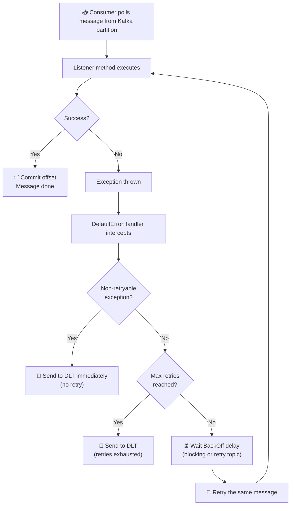
```mermaid
flowchart TD
    POLL["📥 Consumer polls message from Kafka partition"]
    EXEC["Listener method executes"]
    OK{"Success?"}
    COMMIT["✅ Commit offset\nMessage done"]
    ERR["Exception thrown"]
    EH["DefaultErrorHandler intercepts"]
    NR{"Non-retryable\nexception?"}
    DLT_FAST["📨 Send to DLT immediately\n(no retry)"]
    MAX{"Max retries\nreached?"}
    DLT["📨 Send to DLT\n(retries exhausted)"]
    WAIT["⏳ Wait BackOff delay\n(blocking or retry topic)"]
    RETRY["🔁 Retry the same message"]

    POLL --> EXEC
    EXEC --> OK
    OK -->|Yes| COMMIT
    OK -->|No| ERR
    ERR --> EH
    EH --> NR
    NR -->|Yes| DLT_FAST
    NR -->|No| MAX
    MAX -->|Yes| DLT
    MAX -->|No| WAIT
    WAIT --> RETRY
    RETRY --> EXEC
```

---

### Default Behaviour (No Error Handler Configured)

By default, Spring Kafka logs the exception and **seeks back to the failed offset**, then retries that same message on the next poll — indefinitely. This can cause a **poison pill** scenario where one bad message blocks the entire partition forever.

```java
// Default: no error handler → infinite retry on every poll
@KafkaListener(topics = "orders", groupId = "order-service")
public void consume(Order order) {
    throw new RuntimeException("Processing failed");
    // This partition will be stuck retrying this message forever
}
```

Always configure an explicit error handler to avoid this.

---

### Approach 1: Blocking Retry (In-Memory, Using `DefaultErrorHandler`)

`DefaultErrorHandler` retries the failed message **in-memory** within the same consumer thread. While retrying, **no other messages from that partition are processed** — the consumer pauses the partition.

#### How Blocking Retry Works

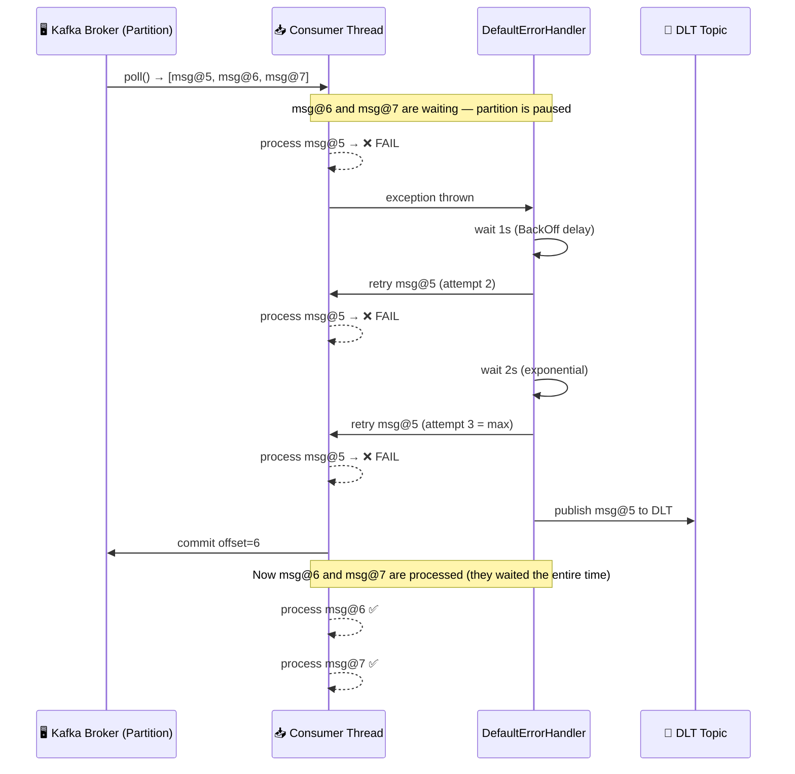
```mermaid
sequenceDiagram
    participant K as 🖥️ Kafka Broker (Partition)
    participant C as 📥 Consumer Thread
    participant EH as DefaultErrorHandler
    participant DLT as 📨 DLT Topic

    K->>C: poll() → [msg@5, msg@6, msg@7]
    Note over C,EH: msg@6 and msg@7 are waiting — partition is paused

    C-->>C: process msg@5 → ❌ FAIL
    C->>EH: exception thrown
    EH->>EH: wait 1s (BackOff delay)
    EH->>C: retry msg@5 (attempt 2)
    C-->>C: process msg@5 → ❌ FAIL
    EH->>EH: wait 2s (exponential)
    EH->>C: retry msg@5 (attempt 3 = max)
    C-->>C: process msg@5 → ❌ FAIL
    EH->>DLT: publish msg@5 to DLT
    C->>K: commit offset=6

    Note over C,EH: Now msg@6 and msg@7 are processed (they waited the entire time)
    C-->>C: process msg@6 ✅
    C-->>C: process msg@7 ✅
```

#### Fixed BackOff (Same Delay Between Each Retry)

```java
@Bean
public ConcurrentKafkaListenerContainerFactory<String, Object> kafkaListenerContainerFactory() {
    ConcurrentKafkaListenerContainerFactory<String, Object> factory =
        new ConcurrentKafkaListenerContainerFactory<>();
    factory.setConsumerFactory(consumerFactory());

    factory.setCommonErrorHandler(new DefaultErrorHandler(
        new FixedBackOff(2000L, 3)  // 2 second delay, max 3 retry attempts
    ));

    return factory;
}
```

**Retry timeline with `FixedBackOff(2000, 3)`:**

| Attempt | Delay Before Attempt | Cumulative Time |
|---------|---------------------|-----------------|
| 1st (initial) | 0 ms | 0 ms |
| 2nd (retry 1) | 2,000 ms | 2 s |
| 3rd (retry 2) | 2,000 ms | 4 s |
| 4th (retry 3) | 2,000 ms | 6 s |
| Exhausted | → Sent to DLT | — |

#### Exponential BackOff (Increasing Delay Between Retries)

```java
@Bean
public ConcurrentKafkaListenerContainerFactory<String, Object> kafkaListenerContainerFactory() {
    ConcurrentKafkaListenerContainerFactory<String, Object> factory =
        new ConcurrentKafkaListenerContainerFactory<>();
    factory.setConsumerFactory(consumerFactory());

    ExponentialBackOffWithMaxRetries backOff = new ExponentialBackOffWithMaxRetries(5);
    backOff.setInitialInterval(1000L);   // 1 second before first retry
    backOff.setMultiplier(2.0);          // double the delay each retry
    backOff.setMaxInterval(60000L);      // cap at 60 seconds

    factory.setCommonErrorHandler(new DefaultErrorHandler(backOff));

    return factory;
}
```

**Retry timeline with `ExponentialBackOff(initial=1s, multiplier=2, max=60s, maxRetries=5)`:**

| Attempt | Delay Before Attempt | Cumulative Time |
|---------|---------------------|-----------------|
| 1st (initial) | 0 ms | 0 ms |
| 2nd (retry 1) | 1,000 ms | 1 s |
| 3rd (retry 2) | 2,000 ms | 3 s |
| 4th (retry 3) | 4,000 ms | 7 s |
| 5th (retry 4) | 8,000 ms | 15 s |
| 6th (retry 5) | 16,000 ms | 31 s |
| Exhausted | → Sent to DLT | — |

#### Blocking Retry with Dead Letter Topic

```java
@Bean
public ConcurrentKafkaListenerContainerFactory<String, Object> kafkaListenerContainerFactory(
        KafkaTemplate<String, Object> kafkaTemplate) {

    DeadLetterPublishingRecoverer recoverer = new DeadLetterPublishingRecoverer(kafkaTemplate,
        (record, ex) -> new TopicPartition(record.topic() + ".DLT", record.partition())
    );

    ExponentialBackOffWithMaxRetries backOff = new ExponentialBackOffWithMaxRetries(3);
    backOff.setInitialInterval(1000L);
    backOff.setMultiplier(2.0);
    backOff.setMaxInterval(10000L);

    DefaultErrorHandler errorHandler = new DefaultErrorHandler(recoverer, backOff);

    ConcurrentKafkaListenerContainerFactory<String, Object> factory =
        new ConcurrentKafkaListenerContainerFactory<>();
    factory.setConsumerFactory(consumerFactory());
    factory.setCommonErrorHandler(errorHandler);
    return factory;
}
```

#### Checking Retry Attempt Count (Blocking)

In blocking retry, the `DefaultErrorHandler` does not add a retry-count header automatically. You can maintain it yourself by catching and re-throwing:

```java
@KafkaListener(topics = "orders", groupId = "order-service")
public void consume(ConsumerRecord<String, Order> record) {
    Header attemptHeader = record.headers().lastHeader("retryAttempt");
    int attempt = attemptHeader != null
        ? Integer.parseInt(new String(attemptHeader.value()))
        : 1;

    if (attempt > 1) {
        logger.warn("Retry attempt {} for order {}",
            attempt, record.value().getOrderId());
    }

    try {
        processOrder(record.value());
    } catch (Exception e) {
        // Increment and forward the attempt count on re-publish (if using retry topics)
        throw e;  // re-throw to trigger DefaultErrorHandler
    }
}
```

---

### Approach 2: Non-Blocking Retry (Using `@RetryableTopic`)

Non-blocking retry is the **recommended approach for production**. Instead of blocking the consumer thread during the delay, it **publishes the failed message to a dedicated retry topic** and continues processing other messages from the main topic.

Each retry attempt has its own topic. The consumer waits in the retry topic until the delay elapses, then processes it again.

#### How Non-Blocking Retry Works

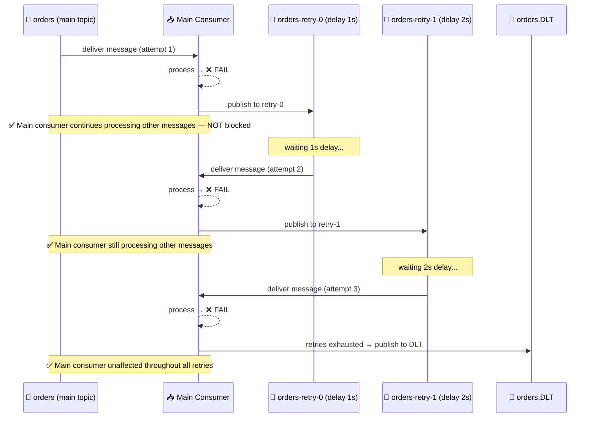
```mermaid
sequenceDiagram
    participant MT as 📂 orders (main topic)
    participant C as 📥 Main Consumer
    participant R0 as 📂 orders-retry-0 (delay 1s)
    participant R1 as 📂 orders-retry-1 (delay 2s)
    participant DLT as 📨 orders.DLT

    MT->>C: deliver message (attempt 1)
    C-->>C: process → ❌ FAIL
    C->>R0: publish to retry-0
    Note over MT,C: ✅ Main consumer continues processing other messages — NOT blocked

    Note over R0: waiting 1s delay...
    R0->>C: deliver message (attempt 2)
    C-->>C: process → ❌ FAIL
    C->>R1: publish to retry-1
    Note over MT,C: ✅ Main consumer still processing other messages

    Note over R1: waiting 2s delay...
    R1->>C: deliver message (attempt 3)
    C-->>C: process → ❌ FAIL
    C->>DLT: retries exhausted → publish to DLT
    Note over MT,C: ✅ Main consumer unaffected throughout all retries
```

**Topic chain created by `@RetryableTopic` (attempts=4):**

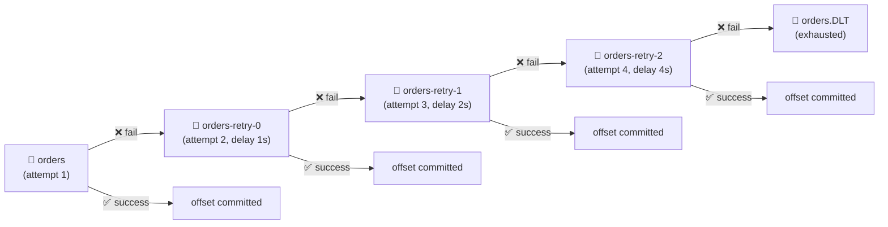
```mermaid
graph LR
    MT["📂 orders\n(attempt 1)"]
    R0["📂 orders-retry-0\n(attempt 2, delay 1s)"]
    R1["📂 orders-retry-1\n(attempt 3, delay 2s)"]
    R2["📂 orders-retry-2\n(attempt 4, delay 4s)"]
    DLT["📨 orders.DLT\n(exhausted)"]

    MT -->|"❌ fail"| R0
    R0 -->|"❌ fail"| R1
    R1 -->|"❌ fail"| R2
    R2 -->|"❌ fail"| DLT
    MT -->|"✅ success"| DONE1["offset committed"]
    R0 -->|"✅ success"| DONE2["offset committed"]
    R1 -->|"✅ success"| DONE3["offset committed"]
    R2 -->|"✅ success"| DONE4["offset committed"]
```

#### Configuring `@RetryableTopic`

```java
@Service
public class OrderConsumer {

    @RetryableTopic(
        attempts = "4",                                    // 1 initial + 3 retries
        backoff = @Backoff(delay = 1000, multiplier = 2),  // 1s, 2s, 4s
        dltTopicSuffix = ".DLT",
        retryTopicSuffix = "-retry",
        autoCreateTopics = "true",
        numPartitions = "3"
    )
    @KafkaListener(topics = "orders", groupId = "order-service")
    public void consume(Order order) {
        logger.info("Processing order: {}", order.getOrderId());
        processOrder(order);
        // If this throws, Spring publishes to "orders-retry-0", "orders-retry-1", etc.
    }

    @DltHandler
    public void handleDlt(Order order, @Header(KafkaHeaders.RECEIVED_TOPIC) String topic) {
        logger.error("DLT: Failed to process order {} from topic {}",
            order.getOrderId(), topic);
        // save to DB, send alert, etc.
    }
}
```

**Topics auto-created by `@RetryableTopic` (with `attempts=4`):**

| Topic | Purpose | Delay Before Processing |
|-------|---------|------------------------|
| `orders` | Main topic (attempt 1) | 0 ms |
| `orders-retry-0` | Retry topic (attempt 2) | 1,000 ms |
| `orders-retry-1` | Retry topic (attempt 3) | 2,000 ms |
| `orders-retry-2` | Retry topic (attempt 4) | 4,000 ms |
| `orders.DLT` | Dead letter topic | No more retry |

#### Non-Blocking Retry Timeline

With `attempts=4, delay=1s, multiplier=2`:

| Attempt | Topic | Delay Before Attempt | Cumulative Time | Main Topic Blocked? |
|---------|-------|---------------------|-----------------|---------------------|
| 1st (initial) | `orders` | 0 ms | 0 ms | No |
| 2nd (retry 1) | `orders-retry-0` | 1,000 ms | 1 s | No ✓ |
| 3rd (retry 2) | `orders-retry-1` | 2,000 ms | 3 s | No ✓ |
| 4th (retry 3) | `orders-retry-2` | 4,000 ms | 7 s | No ✓ |
| Exhausted | `orders.DLT` | — | — | — |

#### Checking Retry Attempt Count in `@RetryableTopic`

Spring Kafka automatically adds headers to retry-topic messages:

```java
@RetryableTopic(attempts = "4", backoff = @Backoff(delay = 1000, multiplier = 2))
@KafkaListener(topics = "orders", groupId = "order-service")
public void consume(
        Order order,
        @Header(KafkaHeaders.RECEIVED_TOPIC) String topic,
        @Header(value = RetryTopicHeaders.DEFAULT_HEADER_ATTEMPTS, required = false) Integer attempt
) {
    int currentAttempt = attempt != null ? attempt : 1;

    if (currentAttempt > 1) {
        logger.warn("Retry attempt {}/4 for order {} (topic: {})",
            currentAttempt, order.getOrderId(), topic);
    }

    processOrder(order);
}
```

**Headers added automatically on retry topics:**

| Header | Content |
|--------|---------|
| `kafka_original-offset` | Offset in the original topic |
| `kafka_original-topic` | The original topic name |
| `kafka_original-partition` | The original partition |
| `kafka_original-timestamp` | Original message timestamp |
| `kafka_retry-attempts` | Current attempt number (1-based) |

#### Per-Topic Retry Configuration

You can apply different retry policies to different topics:

```java
@Service
public class MultiTopicConsumer {

    // High-value orders: more retries, longer delays
    @RetryableTopic(
        attempts = "6",
        backoff = @Backoff(delay = 5000, multiplier = 2, maxDelay = 120000),
        dltTopicSuffix = ".DLT",
        include = {ServiceUnavailableException.class, TimeoutException.class}
    )
    @KafkaListener(topics = "premium-orders", groupId = "order-service")
    public void consumePremiumOrders(Order order) {
        processOrder(order);
    }

    // Notifications: fewer retries, short delays
    @RetryableTopic(
        attempts = "2",
        backoff = @Backoff(delay = 500),
        dltTopicSuffix = ".DLT"
    )
    @KafkaListener(topics = "notifications", groupId = "notification-service")
    public void consumeNotifications(String message) {
        sendNotification(message);
    }

    // Analytics: no retry needed (idempotent, data loss acceptable)
    @KafkaListener(topics = "analytics-events", groupId = "analytics-service")
    public void consumeAnalytics(String event) {
        recordEvent(event);
    }
}
```

#### Excluding Specific Exceptions from Retry

```java
@RetryableTopic(
    attempts = "4",
    backoff = @Backoff(delay = 1000, multiplier = 2),
    // Retry only these exceptions
    include = {ServiceUnavailableException.class, TimeoutException.class},
    // OR: retry everything EXCEPT these
    exclude = {ValidationException.class, MessageConversionException.class}
)
@KafkaListener(topics = "orders", groupId = "order-service")
public void consume(Order order) {
    validateOrder(order);   // throws ValidationException → sent to DLT immediately (no retry)
    callExternalService();  // throws TimeoutException → retried with backoff
}
```

#### How the Consumer Triggers a Retry

A retry is triggered when the `@KafkaListener` method throws **any exception**. Spring Kafka intercepts it at the container level:

```java
@RetryableTopic(attempts = "3", backoff = @Backoff(delay = 1000))
@KafkaListener(topics = "orders", groupId = "order-service")
public void consume(Order order) {

    // Scenario 1: validation failure (non-retryable)
    if (order.getQuantity() <= 0) {
        throw new ValidationException("Invalid quantity");
        // → goes to DLT immediately (if excluded from retry)
    }

    // Scenario 2: downstream service unavailable (retryable)
    inventoryService.reserve(order);
    // If inventoryService throws ServiceUnavailableException
    // → message published to orders-retry-0, retry after 1s

    // Scenario 3: success — no exception → offset committed, done ✓
    logger.info("Order {} processed", order.getOrderId());
}
```

---

### Blocking vs Non-Blocking Retry — Which to Choose?

| Aspect | Blocking (`DefaultErrorHandler`) | Non-Blocking (`@RetryableTopic`) |
|--------|----------------------------------|----------------------------------|
| Main topic paused during delay? | **Yes** — partition is paused | **No** — other messages still processed |
| Extra Kafka topics created? | No | Yes (one per retry level) |
| Suitable for short delays (< 1s) | Yes | Overhead not worth it |
| Suitable for long delays (> 1s) | No — wastes consumer thread | Yes — consumer is free |
| Ordering guarantee | Maintained (same partition) | **May lose ordering** across retries |
| Setup complexity | Simple | Moderate |
| Best for | Low-throughput, short delays | High-throughput, longer delays |

**Rule of thumb:**
- Use **blocking retry** when delays are under 1 second and message ordering is critical.
- Use **non-blocking retry** (`@RetryableTopic`) for production systems with longer delays or high throughput.

---

### Kafka vs ActiveMQ Retry — Key Differences

| Feature | ActiveMQ | Kafka |
|---------|----------|-------|
| Retry managed by | **Broker** | **Consumer application** |
| Configuration location | `RedeliveryPolicy` on `ConnectionFactory` | `DefaultErrorHandler` or `@RetryableTopic` |
| Max retries | `setMaximumRedeliveries(n)` | `FixedBackOff(delay, maxAttempts)` or `attempts="n"` |
| Initial delay | `setInitialRedeliveryDelay(ms)` | `backOff.setInitialInterval(ms)` |
| Exponential backoff | `setUseExponentialBackOff(true)` | `ExponentialBackOffWithMaxRetries` or `@Backoff(multiplier=2)` |
| Max delay cap | `setMaximumRedeliveryDelay(ms)` | `backOff.setMaxInterval(ms)` or `@Backoff(maxDelay=ms)` |
| Failed message destination | Dead Letter Queue (`ActiveMQ.DLQ`) | Dead Letter Topic (`topic.DLT`) |
| Non-blocking retry | Not built-in | `@RetryableTopic` creates retry topic chain |
| Retry count in message | `JMSXDeliveryCount` header | `kafka_retry-attempts` header (retry topics only) |
| Ordering during retry | Maintained | Maintained (blocking) / May break (non-blocking) |

---

## Dead Letter Topics

### What is a Dead Letter Topic?

A **Dead Letter Topic (DLT)** receives messages that failed processing after all retry attempts. Unlike ActiveMQ's DLQ (a queue), Kafka's DLT is just another Kafka topic — it retains messages with the same durability and retention guarantees.

By convention, the DLT name is `<original-topic>.DLT`.

```mermaid
flowchart LR
    Prod["📤 Producer"] -->|"publish"| MT["📂 orders\ntopic"]
    MT -->|"consume\n(attempt 1..N)"| EH["🔁 Error Handler\n+ Retry Logic"]
    EH -->|"✅ success"| OK["Offset committed\nDone"]
    EH -->|"❌ all retries exhausted"| DLT["📨 orders.DLT"]
    DLT -->|"monitor / alert"| Ops["👷 Ops Team\n/ Dashboard"]
    DLT -->|"investigate"| Manual["🔧 Manual Review\n/ DB Save"]
    DLT -->|"re-publish after fix"| MT2["📂 orders\ntopic (re-try)"]
```

### Automatic DLT with DeadLetterPublishingRecoverer

```java
@Bean
public DeadLetterPublishingRecoverer deadLetterPublishingRecoverer(
        KafkaTemplate<String, Object> kafkaTemplate) {
    return new DeadLetterPublishingRecoverer(kafkaTemplate,
        (record, exception) -> {
            // Send to DLT with the same partition as the original message
            return new TopicPartition(record.topic() + ".DLT", record.partition());
        }
    );
}
```

The `DeadLetterPublishingRecoverer` automatically adds these headers to the DLT message:

| Header | Content |
|--------|---------|
| `kafka_dlt-original-topic` | The original topic name |
| `kafka_dlt-original-partition` | The original partition |
| `kafka_dlt-original-offset` | The original offset |
| `kafka_dlt-original-timestamp` | The original message timestamp |
| `kafka_dlt-exception-fqcn` | Fully qualified exception class name |
| `kafka_dlt-exception-message` | The exception message |
| `kafka_dlt-exception-stacktrace` | The full stack trace |

### Consuming from DLT

```java
@Service
public class OrderDltConsumer {

    private static final Logger logger = LoggerFactory.getLogger(OrderDltConsumer.class);

    @KafkaListener(topics = "orders.DLT", groupId = "order-dlt-handler")
    public void consumeDlt(
            ConsumerRecord<String, Order> record,
            @Header("kafka_dlt-exception-message") String exceptionMessage,
            @Header("kafka_dlt-original-offset") long originalOffset
    ) {
        logger.error("DLT message from offset {}, exception: {}", originalOffset, exceptionMessage);

        Order order = record.value();

        // Option 1: Save to database for manual review
        saveForManualReview(order, exceptionMessage);

        // Option 2: Send alert to operations team
        alertOpsTeam(order, exceptionMessage);

        // Option 3: Re-publish to original topic after a fix is deployed
        // kafkaTemplate.send("orders", record.key(), order);
    }
}
```

---

## Kafka Streams (Overview)

Kafka Streams is a library for building real-time stream processing applications that read from and write to Kafka topics.

```java
@Configuration
@EnableKafkaStreams
public class KafkaStreamsConfig {

    @Bean(name = KafkaStreamsDefaultConfiguration.DEFAULT_STREAMS_CONFIG_BEAN_NAME)
    public KafkaStreamsConfiguration kafkaStreamsConfig() {
        Map<String, Object> config = new HashMap<>();
        config.put(StreamsConfig.APPLICATION_ID_CONFIG, "order-stream-processor");
        config.put(StreamsConfig.BOOTSTRAP_SERVERS_CONFIG, "localhost:9092");
        config.put(StreamsConfig.DEFAULT_KEY_SERDE_CLASS_CONFIG, Serdes.String().getClass());
        config.put(StreamsConfig.DEFAULT_VALUE_SERDE_CLASS_CONFIG, Serdes.String().getClass());
        return new KafkaStreamsConfiguration(config);
    }
}

@Component
public class OrderStreamProcessor {

    @Autowired
    void buildPipeline(StreamsBuilder builder) {
        // Read from "orders" topic
        KStream<String, String> orders = builder.stream("orders");

        // Filter only high-value orders and forward to another topic
        orders
            .filter((key, value) -> isHighValue(value))
            .to("high-value-orders");

        // Count orders per customer, write to a table
        orders
            .groupByKey()
            .count()
            .toStream()
            .to("order-counts-per-customer");
    }
}
```

---

## Complete Example

### Project Structure

```
src/main/java/com/example/
├── config/
│   └── KafkaConfig.java
├── model/
│   └── Order.java
├── producer/
│   └── OrderProducer.java
├── consumer/
│   └── OrderConsumer.java
├── controller/
│   └── OrderController.java
└── Application.java
```

### 1. Model

```java
package com.example.model;

import java.io.Serializable;
import java.time.LocalDateTime;

public class Order implements Serializable {

    private String orderId;
    private String customerId;
    private String productName;
    private int quantity;
    private double price;
    private String status;
    private LocalDateTime createdAt;

    public Order() {
    }

    public Order(String orderId, String customerId, String productName, int quantity, double price) {
        this.orderId = orderId;
        this.customerId = customerId;
        this.productName = productName;
        this.quantity = quantity;
        this.price = price;
        this.status = "PENDING";
        this.createdAt = LocalDateTime.now();
    }

    // Getters and Setters
    public String getOrderId() { return orderId; }
    public void setOrderId(String orderId) { this.orderId = orderId; }
    public String getCustomerId() { return customerId; }
    public void setCustomerId(String customerId) { this.customerId = customerId; }
    public String getProductName() { return productName; }
    public void setProductName(String productName) { this.productName = productName; }
    public int getQuantity() { return quantity; }
    public void setQuantity(int quantity) { this.quantity = quantity; }
    public double getPrice() { return price; }
    public void setPrice(double price) { this.price = price; }
    public String getStatus() { return status; }
    public void setStatus(String status) { this.status = status; }
    public LocalDateTime getCreatedAt() { return createdAt; }
    public void setCreatedAt(LocalDateTime createdAt) { this.createdAt = createdAt; }

    @Override
    public String toString() {
        return "Order{orderId='" + orderId + "', customerId='" + customerId +
               "', product='" + productName + "', qty=" + quantity +
               ", price=" + price + ", status='" + status + "'}";
    }
}
```

### 2. Kafka Configuration

```java
package com.example.config;

import com.example.model.Order;
import org.apache.kafka.clients.consumer.ConsumerConfig;
import org.apache.kafka.clients.producer.ProducerConfig;
import org.apache.kafka.common.serialization.StringDeserializer;
import org.apache.kafka.common.serialization.StringSerializer;
import org.springframework.beans.factory.annotation.Value;
import org.springframework.context.annotation.Bean;
import org.springframework.context.annotation.Configuration;
import org.springframework.kafka.annotation.EnableKafka;
import org.springframework.kafka.config.ConcurrentKafkaListenerContainerFactory;
import org.springframework.kafka.config.TopicBuilder;
import org.springframework.kafka.core.*;
import org.springframework.kafka.listener.DeadLetterPublishingRecoverer;
import org.springframework.kafka.listener.DefaultErrorHandler;
import org.springframework.kafka.support.serializer.JsonDeserializer;
import org.springframework.kafka.support.serializer.JsonSerializer;
import org.springframework.util.backoff.FixedBackOff;
import org.apache.kafka.common.TopicPartition;
import org.springframework.kafka.admin.NewTopics;

import java.util.HashMap;
import java.util.Map;

@Configuration
@EnableKafka
public class KafkaConfig {

    @Value("${spring.kafka.bootstrap-servers:localhost:9092}")
    private String bootstrapServers;

    @Bean
    public ProducerFactory<String, Object> producerFactory() {
        Map<String, Object> config = new HashMap<>();
        config.put(ProducerConfig.BOOTSTRAP_SERVERS_CONFIG, bootstrapServers);
        config.put(ProducerConfig.KEY_SERIALIZER_CLASS_CONFIG, StringSerializer.class);
        config.put(ProducerConfig.VALUE_SERIALIZER_CLASS_CONFIG, JsonSerializer.class);
        config.put(ProducerConfig.ACKS_CONFIG, "all");
        config.put(ProducerConfig.RETRIES_CONFIG, 3);
        config.put(ProducerConfig.ENABLE_IDEMPOTENCE_CONFIG, true);
        return new DefaultKafkaProducerFactory<>(config);
    }

    @Bean
    public KafkaTemplate<String, Object> kafkaTemplate() {
        return new KafkaTemplate<>(producerFactory());
    }

    @Bean
    public ConsumerFactory<String, Object> consumerFactory() {
        Map<String, Object> config = new HashMap<>();
        config.put(ConsumerConfig.BOOTSTRAP_SERVERS_CONFIG, bootstrapServers);
        config.put(ConsumerConfig.GROUP_ID_CONFIG, "order-service");
        config.put(ConsumerConfig.KEY_DESERIALIZER_CLASS_CONFIG, StringDeserializer.class);
        config.put(ConsumerConfig.VALUE_DESERIALIZER_CLASS_CONFIG, JsonDeserializer.class);
        config.put(ConsumerConfig.AUTO_OFFSET_RESET_CONFIG, "earliest");
        config.put(JsonDeserializer.TRUSTED_PACKAGES, "com.example.model");
        return new DefaultKafkaConsumerFactory<>(config);
    }

    @Bean
    public ConcurrentKafkaListenerContainerFactory<String, Object> kafkaListenerContainerFactory() {
        ConcurrentKafkaListenerContainerFactory<String, Object> factory =
            new ConcurrentKafkaListenerContainerFactory<>();
        factory.setConsumerFactory(consumerFactory());
        factory.setConcurrency(3);

        DeadLetterPublishingRecoverer recoverer = new DeadLetterPublishingRecoverer(kafkaTemplate(),
            (record, ex) -> new TopicPartition(record.topic() + ".DLT", record.partition()));

        DefaultErrorHandler errorHandler = new DefaultErrorHandler(
            recoverer, new FixedBackOff(1000L, 3)
        );

        factory.setCommonErrorHandler(errorHandler);
        return factory;
    }

    @Bean
    public NewTopics kafkaTopics() {
        return new NewTopics(
            TopicBuilder.name("orders").partitions(3).replicas(1).build(),
            TopicBuilder.name("orders.DLT").partitions(3).replicas(1).build()
        );
    }
}
```

### 3. Producer

```java
package com.example.producer;

import com.example.model.Order;
import org.slf4j.Logger;
import org.slf4j.LoggerFactory;
import org.springframework.beans.factory.annotation.Autowired;
import org.springframework.kafka.core.KafkaTemplate;
import org.springframework.kafka.support.SendResult;
import org.springframework.stereotype.Service;

import java.util.concurrent.CompletableFuture;

@Service
public class OrderProducer {

    private static final Logger logger = LoggerFactory.getLogger(OrderProducer.class);
    private static final String TOPIC = "orders";

    @Autowired
    private KafkaTemplate<String, Object> kafkaTemplate;

    public void sendOrder(Order order) {
        CompletableFuture<SendResult<String, Object>> future =
            kafkaTemplate.send(TOPIC, order.getCustomerId(), order);

        future.whenComplete((result, ex) -> {
            if (ex == null) {
                logger.info("Order {} sent to partition={} offset={}",
                    order.getOrderId(),
                    result.getRecordMetadata().partition(),
                    result.getRecordMetadata().offset());
            } else {
                logger.error("Failed to send order {}: {}", order.getOrderId(), ex.getMessage());
            }
        });
    }
}
```

### 4. Consumer

```java
package com.example.consumer;

import com.example.model.Order;
import org.apache.kafka.clients.consumer.ConsumerRecord;
import org.slf4j.Logger;
import org.slf4j.LoggerFactory;
import org.springframework.kafka.annotation.KafkaListener;
import org.springframework.kafka.support.KafkaHeaders;
import org.springframework.messaging.handler.annotation.Header;
import org.springframework.messaging.handler.annotation.Payload;
import org.springframework.stereotype.Service;

@Service
public class OrderConsumer {

    private static final Logger logger = LoggerFactory.getLogger(OrderConsumer.class);

    @KafkaListener(topics = "orders", groupId = "order-service", concurrency = "3")
    public void consume(
            @Payload Order order,
            @Header(KafkaHeaders.RECEIVED_PARTITION) int partition,
            @Header(KafkaHeaders.OFFSET) long offset
    ) {
        logger.info("Received order {} from partition={} offset={}",
            order.getOrderId(), partition, offset);
        processOrder(order);
    }

    private void processOrder(Order order) {
        logger.info("Processing order: {}", order);
        // business logic here
    }

    @KafkaListener(topics = "orders.DLT", groupId = "order-dlt-service")
    public void consumeDlt(ConsumerRecord<String, Order> record) {
        logger.error("DLT: Failed order at partition={} offset={}: {}",
            record.partition(), record.offset(), record.value());
        // save to DB, alert team, etc.
    }
}
```

### 5. REST Controller

```java
package com.example.controller;

import com.example.model.Order;
import com.example.producer.OrderProducer;
import org.springframework.beans.factory.annotation.Autowired;
import org.springframework.http.ResponseEntity;
import org.springframework.web.bind.annotation.*;

import java.util.UUID;

@RestController
@RequestMapping("/api/orders")
public class OrderController {

    @Autowired
    private OrderProducer orderProducer;

    @PostMapping
    public ResponseEntity<String> placeOrder(@RequestBody Order order) {
        if (order.getOrderId() == null || order.getOrderId().isEmpty()) {
            order.setOrderId(UUID.randomUUID().toString());
        }
        orderProducer.sendOrder(order);
        return ResponseEntity.ok("Order accepted: " + order.getOrderId());
    }

    @GetMapping("/test")
    public ResponseEntity<String> test() {
        Order order = new Order(
            UUID.randomUUID().toString(), "CUST-001", "Test Product", 2, 49.99
        );
        orderProducer.sendOrder(order);
        return ResponseEntity.ok("Test order sent: " + order.getOrderId());
    }
}
```

### 6. Main Application Class

```java
package com.example;

import org.springframework.boot.SpringApplication;
import org.springframework.boot.autoconfigure.SpringBootApplication;

@SpringBootApplication
public class KafkaSpringBootApplication {

    public static void main(String[] args) {
        SpringApplication.run(KafkaSpringBootApplication.class, args);
    }
}
```

---

## Best Practices

### 1. Choose the Right Number of Partitions

- Start with `partitions = max_consumers_expected * 2`
- You can increase partitions later but **cannot decrease** them
- More partitions = more parallelism but also more overhead

### 2. Set Appropriate Retention

```properties
# Retain for 7 days (default)
log.retention.hours=168

# Retain by size (discard oldest when limit is reached)
log.retention.bytes=1073741824  # 1 GB per partition
```

### 3. Use Keys for Ordering

Without a key, messages are distributed round-robin and ordering cannot be guaranteed across partitions. Use a business key when ordering matters:

```java
// All orders for the same customer go to the same partition — ordered
kafkaTemplate.send("orders", order.getCustomerId(), order);
```

### 4. Enable Idempotent Producers

```java
config.put(ProducerConfig.ENABLE_IDEMPOTENCE_CONFIG, true);
```

This prevents duplicate messages when the producer retries after a network timeout.

### 5. Use Manual Offset Commit for Critical Processing

Auto-commit can cause message loss or duplicate processing on failure. Commit manually after confirmed successful processing:

```java
@KafkaListener(topics = "orders", groupId = "order-service")
public void consume(Order order, Acknowledgment ack) {
    processOrder(order);
    ack.acknowledge();  // commit only after processing is done
}
```

### 6. Monitor Consumer Lag

Consumer lag is the number of messages the consumer is behind the producer. High lag indicates the consumer cannot keep up.

```bat
kafka-consumer-groups.bat --describe --group order-service --bootstrap-server localhost:9092
```

| Column | Meaning |
|--------|---------|
| `CURRENT-OFFSET` | The last offset committed by the consumer |
| `LOG-END-OFFSET` | The latest offset written by the producer |
| `LAG` | `LOG-END-OFFSET - CURRENT-OFFSET` |

### 7. Configure Proper Replication for Production

In production, always use replication factor ≥ 2 (ideally 3) and set `min.insync.replicas`:

```properties
# Require at least 2 replicas to acknowledge a write (with acks=all)
min.insync.replicas=2
```

### 8. Handle Deserialization Errors

If a corrupted message causes deserialization to fail, it will block partition processing forever. Add an `ErrorHandlingDeserializer` to route such messages to DLT:

```java
config.put(ConsumerConfig.VALUE_DESERIALIZER_CLASS_CONFIG, ErrorHandlingDeserializer.class);
config.put(ErrorHandlingDeserializer.VALUE_DESERIALIZER_CLASS, JsonDeserializer.class.getName());
```

### 9. Use Transactions for Exactly-Once Semantics

```java
@Bean
public ProducerFactory<String, Object> transactionalProducerFactory() {
    Map<String, Object> config = new HashMap<>();
    // ... base config ...
    config.put(ProducerConfig.TRANSACTIONAL_ID_CONFIG, "order-tx-producer");
    return new DefaultKafkaProducerFactory<>(config);
}

// In your service
@Transactional
public void sendWithTransaction(Order order) {
    kafkaTemplate.send("orders", order);
    kafkaTemplate.send("audit-log", new AuditEntry(order));
    // Both messages are committed atomically, or neither is
}
```

### 10. Testing with Embedded Kafka

```java
@SpringBootTest
@EmbeddedKafka(partitions = 1, topics = {"orders", "orders.DLT"})
class OrderProducerTest {

    @Autowired
    private OrderProducer orderProducer;

    @Autowired
    private EmbeddedKafkaBroker embeddedKafkaBroker;

    @Test
    void testSendOrder() throws Exception {
        Order order = new Order("TEST-001", "CUST-001", "Widget", 1, 9.99);
        assertDoesNotThrow(() -> orderProducer.sendOrder(order));
    }
}
```

---

## Additional Resources

- [Apache Kafka Documentation](https://kafka.apache.org/documentation/)
- [Spring Kafka Documentation](https://docs.spring.io/spring-kafka/docs/current/reference/html/)
- [Kafka Quick Start](https://kafka.apache.org/quickstart)
- [Kafka Downloads](https://kafka.apache.org/downloads)
- [Confluent Kafka Tutorials](https://developer.confluent.io/tutorials/)
